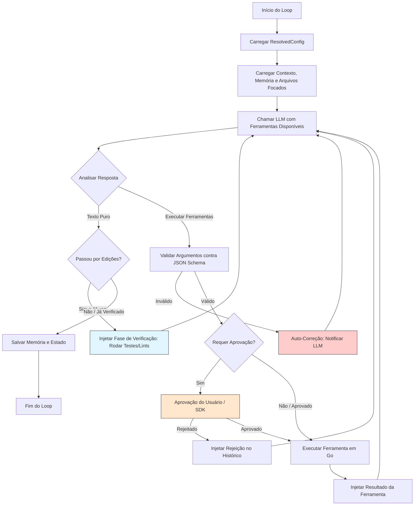

# Arquitetura do crom-agente & crom-agente-sdk

Este documento detalha o design de software do crom-agente (CLI/orquestrador) e do crom-agente-sdk (Go SDK), especificando a estrutura de pastas dos agentes, o funcionamento do loop ReAct, o modelo de concorrência, o sistema de ferramentas isoladas, a **orquestração multi-agente multi-projeto** e o **sistema de configuração em camadas**.

---

## 📁 1. Estrutura de Pastas e Isolamento dos Agentes

Cada agente possui um diretório dedicado para armazenar seu estado operacional, histórico e recursos. Essa estrutura garante o isolamento e permite que o orquestrador gerencie múltiplos agentes separadamente.

### Organização de Pastas do Agente
```
.crom/
└── agents/
    └── [agent_id]/
        ├── config.json         # Parametrização do agente (modelo, temperatura, permissões)
        ├── memory/
        │   ├── state.json      # Estado atual do loop (tarefa ativa, logs curtos, status)
        │   └── context.json    # Memória de longo prazo / fatos aprendidos pelo agente
        ├── artifacts/          # Diretório onde o agente salva arquivos de saída gerados
        ├── tools/              # Ferramentas específicas e scripts criados pelo próprio agente
        └── logs/
            └── execution.log   # Histórico completo de execução e chamadas do LLM
```

- **Isolamento de Diretórios**: Por padrão, o agente interage com o diretório raiz do projeto ("workspace"). No entanto, seus dados internos (memória, logs e ferramentas privadas) são salvos de forma isolada em sua própria pasta sob `.crom/agents/[agent_id]/`.
- **Acesso ao Sistema de Arquivos (Sandbox Ajustável)**: O SDK pode configurar se um agente tem acesso restrito apenas ao workspace (`WorkspaceJail = true`) ou se tem acesso livre a todo o sistema (`WorkspaceJail = false`).

---

## 🌐 2. Orquestração Multi-Agente Multi-Projeto

O binário `crom-agente` **não é um único agente** — ele é um **orquestrador central** capaz de gerenciar N agentes independentes, cada um potencialmente trabalhando em projetos/workspaces diferentes simultaneamente.

### Modelo Conceitual
```
┌──────────────────────────────────────────────────────────────────────┐
│                      crom-agente (Binário/Orquestrador)              │
│                                                                      │
│  ┌─────────────────────┐   ┌─────────────────────┐                  │
│  │  Configuração Global │   │    Orchestrator      │                  │
│  │  (.env + global.json)│   │    (MultiAgentMgr)   │                  │
│  └─────────────────────┘   └───────┬───────────────┘                  │
│                                    │                                  │
│           ┌────────────────────────┼────────────────────────┐        │
│           ▼                        ▼                        ▼        │
│  ┌─────────────────┐     ┌─────────────────┐     ┌────────────────┐ │
│  │  Workspace A     │     │  Workspace B     │     │  Workspace C   │ │
│  │  ~/projeto-web   │     │  ~/api-backend   │     │  ~/lib-shared  │ │
│  │  ┌────────────┐  │     │  ┌────────────┐  │     │  ┌───────────┐│ │
│  │  │ Agent "web" │  │     │  │ Agent "api" │  │     │  │ Agent "lib"││ │
│  │  │ (goroutine) │  │     │  │ (goroutine) │  │     │  │ (goroutine)││ │
│  │  └────────────┘  │     │  └────────────┘  │     │  └───────────┘│ │
│  │  config.json     │     │  config.json     │     │  config.json  │ │
│  │  (workspace cfg) │     │  (workspace cfg) │     │  (workspace)  │ │
│  └─────────────────┘     └─────────────────┘     └────────────────┘ │
└──────────────────────────────────────────────────────────────────────┘
```

### Princípios Fundamentais:
1. **Um binário, N agentes**: O orquestrador roda como processo único e gerencia múltiplos `AgenticLoop` rodando em goroutines concorrentes.
2. **Cada workspace é independente**: Cada projeto/diretório registrado tem suas próprias configurações locais (`config.json`), seus próprios agentes, seus próprios grants de permissão e seu próprio estado.
3. **Agentes podem ter subagentes**: Dentro de cada workspace, um agente pode disparar subagentes para tarefas menores, criando uma **árvore hierárquica de execução**.
4. **Comunicação entre workspaces**: Via o orquestrador central, agentes de workspaces diferentes podem trocar informações (ex: o agente da lib pode notificar o agente da API sobre uma mudança de interface).

### Ciclo de Vida Multi-Agente:
```bash
# Registrar workspaces
$ crom-agente workspace add ~/projeto-web --name "web"
$ crom-agente workspace add ~/api-backend --name "api"

# Disparar tarefas em workspaces diferentes simultaneamente
$ crom-agente run "Refatore o módulo de auth" --workspace web
$ crom-agente run "Atualize a API de pagamentos" --workspace api

# Ver status de todos os agentes ativos
$ crom-agente status --all
```

### Estrutura Go do Orquestrador:
```go
// MultiAgentManager gerencia múltiplos agentes em múltiplos workspaces
type MultiAgentManager struct {
    mu         sync.RWMutex
    workspaces map[string]*WorkspaceContext
    globalCfg  *GlobalConfig
    events     chan OrchestratorEvent
}

// WorkspaceContext contém tudo que um workspace precisa
type WorkspaceContext struct {
    Name       string
    Path       string           // Caminho absoluto do projeto
    Config     *WorkspaceConfig // config.json do workspace
    Agents     map[string]*AgentInstance
    State      *StateManager
}

// AgentInstance é uma instância de agente rodando em goroutine
type AgentInstance struct {
    ID       string
    Loop     *AgenticLoop
    Cancel   context.CancelFunc
    Status   string // "idle", "running", "finished", "error"
    Events   chan SubagentEvent
}
```

---

## ⚙️ 3. Sistema de Configuração em Camadas

O `crom-agente` separa as configurações em **duas camadas** com responsabilidades distintas, cada uma editável pelo próprio binário via CLI.

### 3.1. Configuração Global (`.env` + `global.json`)

Fica **junto ao binário** (ou em `~/.crom/`) e contém dados que são compartilhados por **todos os workspaces e agentes**: credenciais de provedores, endpoints, defaults globais.

```
~/.crom/                          # Ou na mesma pasta do binário
├── .env                          # Segredos e chaves de API
├── global.json                   # Configurações globais editáveis
└── workspaces.json               # Registro de workspaces conhecidos
```

#### `.env` — Segredos (nunca versionado)
```env
# Provedores de LLM
OPENAI_API_KEY=sk-...
ANTHROPIC_API_KEY=sk-ant-...
GEMINI_API_KEY=AIza...
OLLAMA_HOST=http://localhost:11434
OPENROUTER_API_KEY=sk-or-...

# Provider padrão
CROM_DEFAULT_PROVIDER=openai
CROM_DEFAULT_MODEL=gpt-4o
```

#### `global.json` — Defaults Globais
```json
{
  "default_provider": "openai",
  "default_model": "gpt-4o",
  "max_iterations_default": 15,
  "max_consecutive_failures_default": 3,
  "max_tokens_per_task_default": 100000,
  "tool_timeout_seconds_default": 30,
  "max_message_history_default": 40,
  "log_level": "info",
  "telemetry_enabled": false
}
```

### 3.2. Configuração de Workspace (`config.json`)

Fica **dentro de cada workspace** (em `.crom/config.json`) e contém configurações específicas daquele projeto. **Sobrescreve os defaults globais**.

```
~/projeto-web/.crom/
├── config.json                   # Configurações específicas deste workspace
├── permissions.json              # Grants de permissão salvos
└── agents/
    └── main/
        └── state.json
```

#### `config.json` do Workspace
```json
{
  "workspace_name": "projeto-web",
  "provider": "anthropic",
  "model": "claude-sonnet-4-20250514",
  "max_iterations": 25,
  "max_consecutive_failures": 5,
  "max_tokens_per_task": 200000,
  "tool_timeout_seconds": 60,
  "max_message_history": 60,
  "permission_mode": "scoped",
  "workspace_jail": true,
  "system_prompt_override": "",
  "allowed_tools": ["read_file", "write_file", "terminal_command", "search_files"],
  "blocked_commands": ["rm -rf /", "sudo"],
  "auto_verify": true
}
```

### 3.3. Hierarquia de Resolução (Precedência)

Quando o agente precisa de um valor de configuração, ele resolve na seguinte ordem (a mais específica vence):

```
CLI Flags (--max-iterations=30)       ← Máxima prioridade
        ▼
Workspace config.json                 ← Configurações do projeto
        ▼
Global global.json                    ← Defaults do usuário
        ▼
.env (variáveis de ambiente)          ← Segredos e chaves
        ▼
Hardcoded Defaults no código          ← Mínima prioridade
```

### 3.4. Comandos CLI para Gerenciar Configurações

O binário permite ler e escrever configurações **sem editar arquivos manualmente**:

```bash
# ═══════════════════════════════════════
# CONFIGURAÇÃO GLOBAL
# ═══════════════════════════════════════

# Ver todas as configurações globais
$ crom-agente config global list

# Ler um valor global
$ crom-agente config global get default_model
# → gpt-4o

# Setar um valor global
$ crom-agente config global set max_iterations_default 25

# Setar uma variável no .env
$ crom-agente config env set OPENAI_API_KEY sk-nova-chave...

# Listar variáveis do .env (mascaradas)
$ crom-agente config env list
# OPENAI_API_KEY=sk-***...
# ANTHROPIC_API_KEY=sk-ant-***...

# ═══════════════════════════════════════
# CONFIGURAÇÃO DE WORKSPACE
# ═══════════════════════════════════════

# Ver configurações do workspace atual (ou especificado)
$ crom-agente config workspace list
$ crom-agente config workspace list --workspace api

# Ler um valor do workspace
$ crom-agente config workspace get max_iterations

# Setar um valor do workspace
$ crom-agente config workspace set max_iterations 30
$ crom-agente config workspace set permission_mode total_access

# Ver configuração efetiva resolvida (merge de global + workspace + flags)
$ crom-agente config resolved
```

### 3.5. Estrutura Go do Sistema de Configuração
```go
// GlobalConfig é carregada do .env + global.json junto ao binário
type GlobalConfig struct {
    // Provedores (do .env)
    OpenAIAPIKey      string `env:"OPENAI_API_KEY"`
    AnthropicAPIKey   string `env:"ANTHROPIC_API_KEY"`
    GeminiAPIKey      string `env:"GEMINI_API_KEY"`
    OllamaHost        string `env:"OLLAMA_HOST"`
    OpenRouterAPIKey  string `env:"OPENROUTER_API_KEY"`
    
    // Defaults globais (do global.json)
    DefaultProvider            string `json:"default_provider"`
    DefaultModel               string `json:"default_model"`
    MaxIterationsDefault       int    `json:"max_iterations_default"`
    MaxConsecutiveFailDefault  int    `json:"max_consecutive_failures_default"`
    MaxTokensPerTaskDefault    int    `json:"max_tokens_per_task_default"`
    ToolTimeoutSecondsDefault  int    `json:"tool_timeout_seconds_default"`
    MaxMessageHistoryDefault   int    `json:"max_message_history_default"`
    LogLevel                   string `json:"log_level"`
}

// WorkspaceConfig é carregada do config.json dentro de cada workspace
type WorkspaceConfig struct {
    WorkspaceName      string   `json:"workspace_name"`
    Provider           string   `json:"provider,omitempty"`
    Model              string   `json:"model,omitempty"`
    MaxIterations      *int     `json:"max_iterations,omitempty"`
    MaxConsecutiveFail *int     `json:"max_consecutive_failures,omitempty"`
    MaxTokensPerTask   *int     `json:"max_tokens_per_task,omitempty"`
    ToolTimeoutSeconds *int     `json:"tool_timeout_seconds,omitempty"`
    MaxMessageHistory  *int     `json:"max_message_history,omitempty"`
    PermissionMode     string   `json:"permission_mode"`
    WorkspaceJail      bool     `json:"workspace_jail"`
    AllowedTools       []string `json:"allowed_tools,omitempty"`
    BlockedCommands    []string `json:"blocked_commands,omitempty"`
    AutoVerify         bool     `json:"auto_verify"`
}

// ResolvedConfig é o resultado do merge de todas as camadas
type ResolvedConfig struct {
    Provider           string
    Model              string
    MaxIterations      int
    MaxConsecutiveFail int
    MaxTokensPerTask   int
    ToolTimeoutSeconds int
    MaxMessageHistory  int
    PermissionMode     string
    WorkspaceJail      bool
    AutoVerify         bool
    // ... (campos resolvidos finais)
}

// Resolve aplica a hierarquia de precedência
func Resolve(global *GlobalConfig, workspace *WorkspaceConfig, flags CLIFlags) *ResolvedConfig
```

---

## 🔁 4. O Loop ReAct Autônomo (`AgenticLoop`)

O ciclo de execução em Go é implementado de forma iterativa através do padrão **ReAct (Reasoning and Acting)**. Todos os limites (iterações, tokens, timeouts) são **configuráveis** via o sistema de camadas descrito acima.



### Características Especiais do Loop em Go:
- **Limites Configuráveis**: `MaxIterations`, `MaxConsecutiveFailures`, `ToolTimeoutSeconds` e `MaxMessageHistory` são lidos da `ResolvedConfig` ao invés de constantes hardcoded.
- **Controle por Contexto (`context.Context`)**: Permite cancelar instantaneamente loops em andamento e define limites de timeout totais ou por chamada.
- **Detecção de Loops Repetitivos**: Uma pilha interna armazena resumos dos estados anteriores. Se o agente tentar realizar a mesma ação repetidamente com os mesmos parâmetros sem obter sucesso, o orquestrador injeta uma instrução imperativa exigindo mudança de estratégia.
- **Auto-Correção Nativa**: Se o LLM tentar gerar código diretamente na mensagem de texto (leaking) em vez de chamar as ferramentas formais (`write_file`, etc.), o orquestrador bloqueia e re-solicita a chamada formatada.

---

## 🔀 5. Concorrência e Árvore de Subagentes

Go brilha no quesito concorrência. A relação entre o agente principal e subagentes baseia-se em uma hierarquia de **Goroutines** e **Channels**.

```
[Orquestrador Central]
        │
        ├── [Workspace A: ~/projeto-web]
        │       │
        │       ├── Agent "web" (goroutine principal)
        │       │       ├── Subagente "refactor-auth" (goroutine filha)
        │       │       └── Subagente "update-tests" (goroutine filha)
        │       │
        │       └── Agent "design" (goroutine independente)
        │
        └── [Workspace B: ~/api-backend]
                │
                └── Agent "api" (goroutine principal)
                        └── Subagente "migrate-db" (goroutine filha)
```

### Mecanismo de Comunicação:
- **Criação**: O agente principal executa a ferramenta `spawn_subagent`, definindo uma tarefa especializada (ex: "Refatore o módulo de autenticação").
- **Execução Concorrente**: O orquestrador instancia um novo `AgenticLoop` em uma goroutine separada, isolando seu histórico de conversação e arquivos de foco.
- **Sincronização**: O subagente comunica-se de volta com o agente pai através de canais Go estruturados (`chan SubagentEvent`). O agente pai pode aguardar bloqueado ou receber atualizações assíncronas do progresso dos subagentes em tempo real.
- **Cross-Workspace**: Agentes de workspaces diferentes podem trocar eventos via o canal central do `MultiAgentManager`.

---

## 🛠️ 6. Registro e Execução de Ferramentas (Tool Registry)

As ferramentas nativas são implementadas em Go puro sob uma interface comum. A flexibilidade do `crom-agente-sdk` permite expandir as ferramentas de duas formas:
1. **Registro Programático via SDK**: Desenvolvimento de novas structs em Go que implementam a interface `Tool`.
2. **Extensibilidade Dinâmica de Scripts**: O orquestrador permite registrar diretórios de scripts externos (ex: `.crom/tools/` ou scripts em Python, Bash, Node). Cada script encontrado na pasta é mapeado dinamicamente como uma ferramenta executável para o LLM, injetando sua assinatura automaticamente no JSON Schema.

### Validação de Parâmetros
O orquestrador compila os schemas JSON das ferramentas. Antes de disparar a execução, ele valida os argumentos recebidos do LLM usando uma biblioteca de JSON Schema em Go, prevenindo erros de tipagem e valores ausentes.

### Segurança e Execução de Comandos
- **PTY Integrado (Pseudo-Terminais)**: A execução de comandos shell (`terminal_command`) utiliza PTYs virtuais (`creack/pty`). Isso permite simular terminais interativos reais para o sistema operacional, enquanto o orquestrador filtra as saídas, impõe limites de tamanho (ex: max 50k caracteres) e cancela processos que excedem o timeout (configurável via `tool_timeout_seconds`).
- **Proteção contra Privilege Escalation**: Comandos são parseados para identificar e bloquear injeções perigosas como subshells ocultos, redirecionamentos circulares ou privilégios de administrador (`sudo`).

---

## 🔒 7. Modelo de Permissões e HITL (Human-in-the-Loop)

Para equilibrar segurança operacional e usabilidade, o orquestrador implementa um **Gerenciador de Permissões (`PermissionManager`)** com três modos configuráveis **por workspace** (via `config.json` do workspace):

```
                  [Ação Crítica Disparada (ex: comando git)]
                                      │
                         ┌────────────▼────────────┐
                         │ Qual o Modo de Permissão?│
                         │  (do workspace config)   │
                         └──────┬───────────┬──────┘
             Total Access       │           │        Ask Every Time
          ┌─────────────────────┘           └──────────────────────┐
          ▼                                                        ▼
   [Executar Ação]                                         [Perguntar ao Usuário]
          ▲                                                        │
          │                                 Scoped                 │
          │                      ┌─────────────────────────────────┘
          │                      ▼
          │         [Checar Whitelist de Grants]
          │         (permissions.json do workspace)
          │            │                  │
          │         Match               No Match
          │            │                  │
          ├────────────┘                  ▼
          │                     [Perguntar ao Usuário]
          │                        │             │
          │                    Aprovar         Rejeitar
          │                        │             │
          │             ┌──────────┴──────────┐  ▼
          │             │ Lembrar para sempre?│ [Bloquear Execução]
          │             └──────┬───────────┬──┘
          │                   Sim          Não
          │                    │           │
          │             [Salvar Grant]     │
          └────────────────────┴───────────┘
```

### Os Três Modos de Permissão (configurável por workspace):
1. **Acesso Total (`total_access`)**: 
   - O agente tem permissão irrestrita para rodar qualquer comando e editar qualquer arquivo. Útil para ambientes já isolados (containers/VMs) ou tarefas automatizadas em pipelines.
2. **Perguntar Sempre (`ask_every_time`)**: 
   - HITL estrito. Cada comando, escrita ou deleção deve ser explicitamente aprovado pelo usuário no console ou através da interface, sem memorização de decisões passadas.
3. **Permissões Escopadas (`scoped`)** _(padrão)_:
   - O agente inicia perguntando tudo. No entanto, quando solicita uma permissão (ex: rodar `git status`), o usuário tem a opção de aprovar **uma única vez** ou **aprovar e conceder acesso permanente àquele escopo** (ex: liberar qualquer comando `git` ou qualquer escrita sob o diretório `src/`).
   - O gerenciador armazena esses grants em `permissions.json` dentro do workspace:
     ```go
     type PermissionGrant struct {
         Action string // Ex: "command", "write_file"
         Target string // Ex: "git *", "/workspace/src/*"
     }
     ```
   - Se o comando subsequente der match com um grant existente, o orquestrador executa de forma autônoma sem interromper o usuário.

---

## 🖥️ 8. Daemon Persistente & System Tray

O `crom-agente` opera como um **daemon persistente** (servidor de fundo), similar ao `llama.cpp --server` ou ao Docker Desktop. Ele fica rodando continuamente, com um **ícone fixo na bandeja do sistema** (system tray, próximo ao relógio), pronto para receber comandos e orquestrar agentes.

### 8.1. Arquitetura Dual-Mode (Daemon ↔ CLI Client)

O binário `crom-agente` tem **dois modos de operação** no mesmo executável:

```
┌─────────────────────────────────────────────────────────────────┐
│                        MODO DAEMON (server)                     │
│                    $ crom-agente daemon start                   │
│                                                                 │
│  ┌──────────────┐  ┌──────────────┐  ┌──────────────────────┐  │
│  │  System Tray  │  │  IPC Server  │  │  MultiAgentManager   │  │
│  │  (ícone +     │  │  (Unix Socket│  │  (goroutines dos     │  │
│  │   menu)       │  │   ou TCP)    │  │   agentes ativos)    │  │
│  └──────┬───────┘  └──────┬───────┘  └──────────┬───────────┘  │
│         │                 │                      │              │
│         │    ┌────────────┴──────────────────────┘              │
│         │    │                                                  │
│         ▼    ▼                                                  │
│  ┌──────────────────┐                                          │
│  │  Event Bus        │ ← Notificações Desktop                  │
│  │  (chan events)     │ ← Status dos agentes                   │
│  └──────────────────┘                                          │
└─────────────────────────────────────────────────────────────────┘
           ▲                    ▲                    ▲
           │ IPC                │ IPC                │ IPC
┌──────────┴───┐    ┌──────────┴───┐    ┌──────────┴───┐
│  CLI Client  │    │  CLI Client  │    │  SDK App     │
│  (terminal)  │    │  (terminal)  │    │  (Go import) │
└──────────────┘    └──────────────┘    └──────────────┘
```

### 8.2. Comandos do Daemon

```bash
# ═══════════════════════════════════════
# CICLO DE VIDA DO DAEMON
# ═══════════════════════════════════════

# Iniciar o daemon (com tray icon)
$ crom-agente daemon start
# → 🟢 crom-agente daemon iniciado (PID: 12345)
# → 📌 Ícone adicionado à bandeja do sistema
# → 🔌 Escutando em: ~/.crom/crom-agente.sock

# Iniciar sem tray (modo headless, para servidores)
$ crom-agente daemon start --headless
# → 🟢 crom-agente daemon iniciado (PID: 12345, headless)

# Verificar status do daemon
$ crom-agente daemon status
# → 🟢 Daemon ativo (PID: 12345, uptime: 2h34m)
# →    Agentes ativos: 3 (web: running, api: idle, lib: finished)
# →    Memória: 45MB | Goroutines: 12

# Parar o daemon
$ crom-agente daemon stop
# → 🔴 Daemon encerrado graciosamente

# Reiniciar
$ crom-agente daemon restart

# Habilitar auto-start com o sistema
$ crom-agente daemon autostart --enable
# → ✅ Adicionado ao autostart do sistema (systemd/launchd/startup)
```

### 8.3. Detecção Automática de Daemon

Quando o usuário roda qualquer comando CLI, o binário **detecta automaticamente** se um daemon está rodando:

```
$ crom-agente run "Analise o código" --workspace web

   ┌─ Daemon rodando? ─┐
   │                    │
   Sim                  Não
   │                    │
   ▼                    ▼
[Envia comando      [Executa diretamente
 via IPC Socket      no processo atual
 ao daemon]          (modo standalone)]
```

- **Com daemon**: O CLI se torna um **cliente leve** que envia o comando ao daemon via Unix Socket e exibe o output em streaming.
- **Sem daemon**: O CLI executa tudo inline, como se fosse standalone (backward-compatible).

### 8.4. System Tray (Ícone na Bandeja)

O ícone na bandeja do sistema oferece acesso rápido via menu de contexto (clique direito):

```
╔═══════════════════════════════════════╗
║  🤖 crom-agente v0.1.0               ║
╠═══════════════════════════════════════╣
║                                       ║
║  Estado: 🟢 Ativo (3 agentes)        ║
║                                       ║
║  ┌─ Agentes ────────────────────────┐ ║
║  │  🔵 web    → "Refatorando auth"  │ ║
║  │  ⚪ api    → Idle                │ ║
║  │  ✅ lib    → Concluído           │ ║
║  └──────────────────────────────────┘ ║
║                                       ║
║  ─────────────────────────────────── ║
║  📊  Dashboard (abre terminal)       ║
║  ⚙️  Configurações                   ║
║  📋  Ver Logs                         ║
║  ─────────────────────────────────── ║
║  🔄  Reiniciar Daemon                ║
║  ⏹️  Parar Daemon                    ║
║  ─────────────────────────────────── ║
║  ❓  Sobre                            ║
╚═══════════════════════════════════════╝
```

**Recursos do Tray:**
- **Ícone dinâmico**: Muda de cor conforme o estado:
  - 🟢 Verde: Daemon ativo, agentes idle
  - 🔵 Azul pulsante: Agentes trabalhando
  - 🔴 Vermelho: Erro em algum agente
  - ⚪ Cinza: Daemon parado
- **Notificações Desktop**: Envia notificações do sistema quando:
  - Um agente conclui uma tarefa
  - Um agente encontra um erro que precisa de atenção
  - Um agente solicita aprovação (HITL no modo `scoped`)
- **Quick Actions**: Menu do tray permite iniciar/parar agentes sem abrir o terminal

### 8.5. Notificações Desktop

```
┌──────────────────────────────────────┐
│ 🤖 crom-agente                       │
│                                      │
│ ✅ Agente "web" concluiu:            │
│ "Refatoração do módulo de auth"      │
│                                      │
│ 🔧 3 arquivos modificados            │
│ ✅ Todos os testes passaram          │
│                                      │
│          [Ver Detalhes]  [Ignorar]   │
└──────────────────────────────────────┘
```

### 8.6. Comunicação IPC (Inter-Process Communication)

A comunicação entre CLI/SDK e o daemon usa **Unix Domain Socket** (Linux/macOS) ou **Named Pipe** (Windows):

```go
// IPCServer escuta comandos no socket Unix
type IPCServer struct {
    listener  net.Listener
    socketPath string            // ~/.crom/crom-agente.sock
    manager   *MultiAgentManager
}

// IPCMessage é o protocolo de comunicação CLI ↔ Daemon
type IPCMessage struct {
    Type      string          `json:"type"`      // "run", "status", "stop", "config"
    Workspace string          `json:"workspace,omitempty"`
    Payload   json.RawMessage `json:"payload,omitempty"`
}

// IPCResponse é a resposta do daemon para o CLI
type IPCResponse struct {
    Success bool            `json:"success"`
    Data    json.RawMessage `json:"data,omitempty"`
    Error   string          `json:"error,omitempty"`
    Stream  bool            `json:"stream"`  // Se true, mais mensagens seguirão
}
```

### 8.7. Estrutura Go do Daemon

```go
// Daemon gerencia o ciclo de vida completo do servidor persistente
type Daemon struct {
    manager    *MultiAgentManager
    ipcServer  *IPCServer
    tray       *SystemTray       // nil se --headless
    notifier   *DesktopNotifier
    pidFile    string            // ~/.crom/crom-agente.pid
    config     *GlobalConfig
}

// SystemTray abstrai a integração com a bandeja do sistema
type SystemTray struct {
    icon      []byte           // Ícone em PNG/ICO
    menuItems []*MenuItem
    onReady   func()
    onExit    func()
}

// DesktopNotifier envia notificações do sistema operacional
type DesktopNotifier struct {
    appName string
    icon    string
}

func (d *DesktopNotifier) Notify(title, message string, urgency NotifyUrgency) error
```

### 8.8. Dependências Go para o Daemon

| Biblioteca | Função |
|---|---|
| `getlantern/systray` | Ícone e menu na bandeja do sistema (Linux/macOS/Windows) |
| `gen2brain/beeep` | Notificações desktop nativas (libnotify/osascript/toast) |
| `net` (stdlib) | Unix Domain Sockets para IPC |
| `os/signal` (stdlib) | Captura de SIGTERM/SIGINT para shutdown gracioso |

### 8.9. Modo Headless (Servidores/CI)

Para ambientes sem interface gráfica (servidores, containers, CI/CD), o daemon roda em **modo headless**:

```bash
$ crom-agente daemon start --headless --port 9090
```

- Sem system tray, sem notificações desktop
- Expõe uma API HTTP/gRPC na porta especificada (ao invés de socket Unix)
- Permite controle remoto via rede local
- Útil para integração com pipelines de CI e orquestração em cloud
