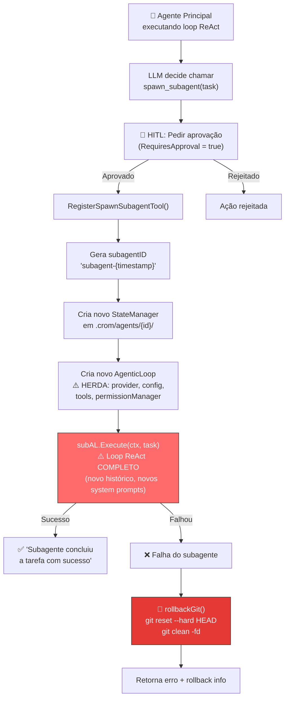
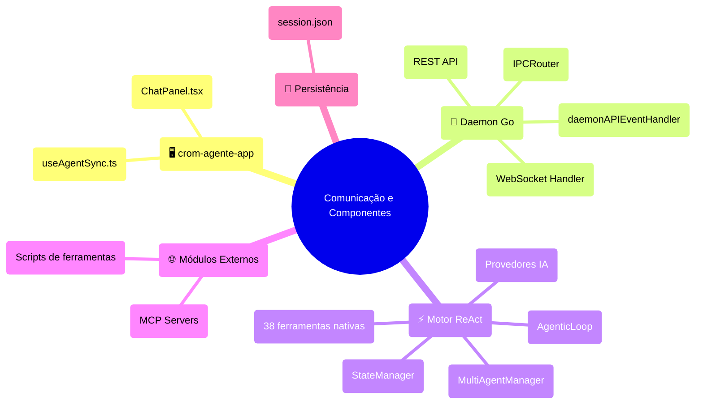
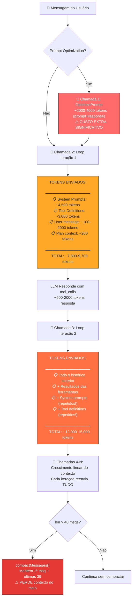
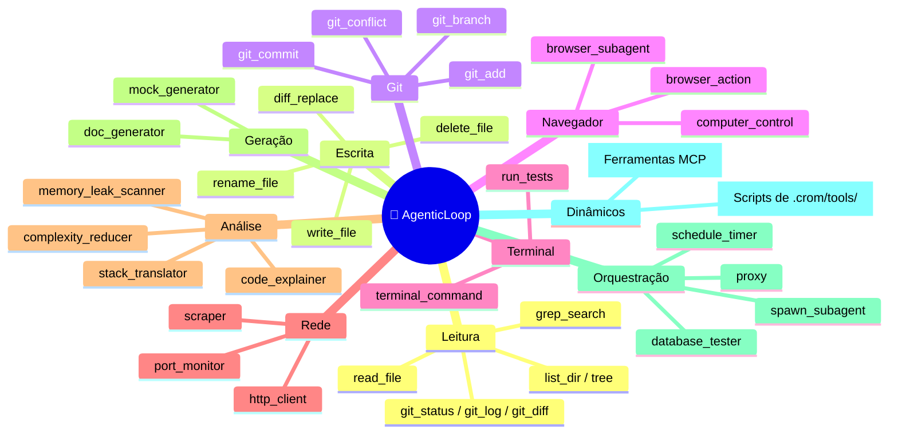
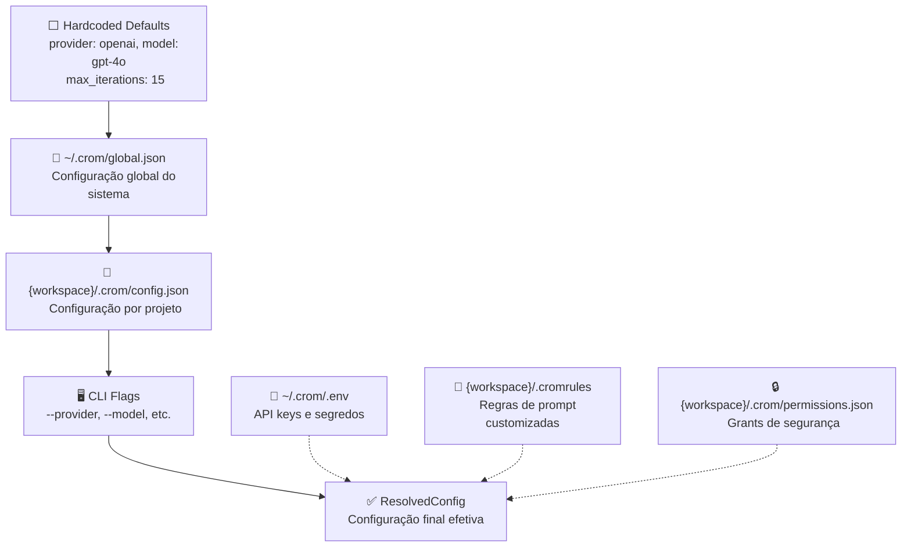

# 🏗️ Análise Arquitetural Profunda — crom-agente

## 📦 Estrutura de Pacotes

```
crom-agente/
├── cmd/
│   ├── crom-agente/       # Entry point do daemon
│   └── crom-agente-cli/   # Entry point da CLI
├── internal/
│   ├── blackbox/          # Módulo de caixa preta (testes isolados)
│   ├── cli/               # Lógica da CLI interativa
│   ├── cli-tui/           # TUI (Text User Interface)
│   ├── config/             # Sistema de configuração em camadas
│   ├── cron/              # Tarefas agendadas
│   ├── daemon/            # Daemon HTTP + WebSocket + gRPC
│   ├── llm/               # Abstração de provedores de IA
│   ├── loop/              # Motor ReAct (coração do sistema)
│   ├── mcp/               # Protocol MCP (Model Context Protocol)
│   ├── orchestrator/      # Multi-Agente Manager
│   ├── permission/        # HITL (Human-in-the-Loop) Permissions
│   ├── security/          # Redação de dados sensíveis
│   ├── state/             # Persistência de estado (sessões)
│   └── tools/             # 38 ferramentas nativas
├── pkg/
│   ├── config/            # Config pública para SDK
│   └── sdk/               # SDK programático para agentes
├── scripts/               # Scripts auxiliares
└── tests/                 # Testes de integração
```

---

## 🔄 Fluxograma 1: Loop ReAct Principal (Agente)

Este é o **coração do sistema**. O `AgenticLoop.Execute()` segue o padrão **ReAct** (Reason + Act):

```mermaid
flowchart TD
    START["🚀 Execute(ctx, intent)"] --> INIT_STATUS["handler.OnStatusChange('thinking')"]
    INIT_STATUS --> LOAD_MSGS["Carregar mensagens do StateManager"]
    LOAD_MSGS --> FIRST_MSG{É a primeira mensagem?}
    
    FIRST_MSG -->|Sim| OPTIMIZE{"Prompt Optimization habilitada?"}
    OPTIMIZE -->|Sim| LLM_OPTIMIZE["🔮 Chamada LLM: OptimizePrompt()
    ⚠️ GASTA TOKENS EXTRAS"]
    OPTIMIZE -->|Não| CREATE_MSG["Criar mensagem user com intent"]
    LLM_OPTIMIZE --> CREATE_MSG
    FIRST_MSG -->|Não| APPEND_MSG["Append intent às mensagens existentes"]
    
    CREATE_MSG --> INJECT_SYS["💉 Injetar 8-10 mensagens SYSTEM
    (Identidade, Stack, Portas, Regras,
     Planejamento, Uso de Tools, etc.)
    ⚠️ ~4000-5000 TOKENS FIXOS"]
    APPEND_MSG --> LOOP_START
    
    INJECT_SYS --> SAVE_MSGS1["SaveMsgs → StateManager → disco"]
    SAVE_MSGS1 --> LOOP_START
    
    LOOP_START["🔁 for i = 0 → MaxIterations"] --> CTX_CHECK{"ctx cancelado?"}
    CTX_CHECK -->|Sim| EXIT_CANCEL["❌ Loop cancelado"]
    CTX_CHECK -->|Não| DETECT_REP{"Detecta loop repetitivo?"}
    
    DETECT_REP -->|Sim| INJECT_WARN["⚠️ Injeta REPETITIVE_LOOP_WARNING"]
    DETECT_REP -->|Não| BUILD_OPTS
    INJECT_WARN --> BUILD_OPTS
    
    BUILD_OPTS["buildRequestOptions()
    Gera ToolDefinitions das 30+ tools
    ⚠️ ~3000+ TOKENS nas definições"] --> SYNC_PLAN["SyncPlanToContext()
    Injeta plano atualizado"]
    
    SYNC_PLAN --> COMPACT["compactMessages()
    Limita a 40 mensagens"]
    
    COMPACT --> LLM_CALL["📡 provider.SendMessages()
    ⚠️ CHAMADA LLM PRINCIPAL
    Prompt + History + Tools"]
    
    LLM_CALL -->|Erro| EXIT_ERROR["❌ Erro na chamada LLM
    (rate limit, auth, timeout)"]
    LLM_CALL -->|OK| RECORD_TOKENS["📊 RecordTokens()
    tokens_gastos += total_tokens"]
    
    RECORD_TOKENS --> CHECK_RESP{"Resposta vazia?"}
    CHECK_RESP -->|Sim| EMPTY_RESP["Injeta SYSTEM CORRECTION
    consecutiveFailures++"]
    CHECK_RESP -->|Não| HAS_TOOLS{"Tem tool_calls?"}
    
    HAS_TOOLS -->|Não| TASK_DONE["✅ Tarefa concluída
    handler.OnStatusChange('finished')"]
    
    HAS_TOOLS -->|Sim| EXEC_TOOLS["🔧 Para cada tool_call:"]
    EXEC_TOOLS --> TOOL_EXISTS{"Ferramenta existe?"}
    TOOL_EXISTS -->|Não| TOOL_NOT_FOUND["ERR_TOOL_NOT_FOUND"]
    TOOL_EXISTS -->|Sim| NEEDS_APPROVAL{"RequiresApproval()?"}
    
    NEEDS_APPROVAL -->|Sim| CHECK_PERM["PermissionManager.Authorize()"]
    CHECK_PERM -->|Rejeitado| PERM_DENIED["ERR_PERMISSION_DENIED"]
    CHECK_PERM -->|Aprovado| EXEC_TOOL
    NEEDS_APPROVAL -->|Não| EXEC_TOOL
    
    EXEC_TOOL["tool.Execute(ctx, args)
    com timeout configurável"] --> TOOL_RESULT{"Sucesso?"}
    TOOL_RESULT -->|Sim| SAVE_RESULT["Append resultado OK"]
    TOOL_RESULT -->|Não| SAVE_ERROR["Append resultado ERRO
    iterationHasFailure = true"]
    
    SAVE_RESULT --> NEXT_TOOL
    SAVE_ERROR --> NEXT_TOOL
    TOOL_NOT_FOUND --> NEXT_TOOL
    PERM_DENIED --> NEXT_TOOL
    
    NEXT_TOOL{"Mais tool_calls?"} -->|Sim| EXEC_TOOLS
    NEXT_TOOL -->|Não| CHECK_FAIL{"consecutiveFailures >= max?"}
    
    CHECK_FAIL -->|Sim| EXIT_FAIL["❌ Abort: falhas consecutivas"]
    CHECK_FAIL -->|Não| LOOP_START
    EMPTY_RESP --> CHECK_FAIL
    
    style LLM_OPTIMIZE fill:#ff6b6b,stroke:#333,color:#fff
    style LLM_CALL fill:#ff6b6b,stroke:#333,color:#fff
    style INJECT_SYS fill:#ffa726,stroke:#333,color:#fff
    style BUILD_OPTS fill:#ffa726,stroke:#333,color:#fff
    style RECORD_TOKENS fill:#4caf50,stroke:#333,color:#fff
```



---

## 🔄 Fluxograma 2: Criação e Execução de Subagente



> [!IMPORTANT]
> O subagente atual é **síncrono e bloqueante** — o agente principal ESPERA o subagente terminar antes de continuar. O subagente roda um loop ReAct completo com seus próprios system prompts, o que significa **duplicação de tokens**.

---

## 🔄 Fluxograma 3: Comunicação Frontend ↔ Daemon ↔ Agente



---

## 🔄 Fluxograma 4: Fluxo de Tokens por Requisição



---

## 📋 Mapeamento de Prompts Hardcoded

Todos os prompts do sistema estão **hardcoded diretamente no Go** em [agentic_loop.go](file:///home/j/Documentos/GitHub/crom-agente/internal/loop/agentic_loop.go):

| # | ID do Prompt | Linha | Tamanho Estimado | Finalidade |
|---|---|---|---|---|
| 1 | `SYSTEM AGENTIC IDENTITY` | [L154](file:///home/j/Documentos/GitHub/crom-agente/internal/loop/agentic_loop.go#L154) | ~700 chars | Identidade do agente |
| 2 | `SYSTEM STACK DETECTED` | [L161](file:///home/j/Documentos/GitHub/crom-agente/internal/loop/agentic_loop.go#L161) | ~100 chars | Stack técnica detectada |
| 3 | `SYSTEM PORT CONFLICT HANDLING` | [L167](file:///home/j/Documentos/GitHub/crom-agente/internal/loop/agentic_loop.go#L167) | ~400 chars | Conflito de portas |
| 4 | `SYSTEM LOCAL RULES` | [L174](file:///home/j/Documentos/GitHub/crom-agente/internal/loop/agentic_loop.go#L174) | dinâmico | Regras do workspace |
| 5 | `SYSTEM PLANNING REQUIREMENT` | [L181](file:///home/j/Documentos/GitHub/crom-agente/internal/loop/agentic_loop.go#L181) | ~800 chars | Planejamento obrigatório |
| 6 | `SYSTEM TOOL USAGE REQUIREMENT` | [L187](file:///home/j/Documentos/GitHub/crom-agente/internal/loop/agentic_loop.go#L187) | ~500 chars | Uso obrigatório de tools |
| 7 | `SYSTEM FILE IMPACT PLANNING` | [L193](file:///home/j/Documentos/GitHub/crom-agente/internal/loop/agentic_loop.go#L193) | ~300 chars | Proposed Changes |
| 8 | `SYSTEM SCREENSHOT PATH REQ.` | [L199](file:///home/j/Documentos/GitHub/crom-agente/internal/loop/agentic_loop.go#L199) | ~600 chars | Path para screenshots |
| 9 | `SYSTEM SESSION ISOLATION` | [L211](file:///home/j/Documentos/GitHub/crom-agente/internal/loop/agentic_loop.go#L211) | ~500 chars | Isolamento de sessão |
| 10 | `SYSTEM PHASE: PLANNING` | [L220](file:///home/j/Documentos/GitHub/crom-agente/internal/loop/agentic_loop.go#L220) | ~600 chars | Fase de planejamento |
| 11 | `SYSTEM PHASE: EXECUTION` | [L225](file:///home/j/Documentos/GitHub/crom-agente/internal/loop/agentic_loop.go#L225) | ~300 chars | Fase de execução |
| 12 | `SYSTEM CORRECTION` | [L372](file:///home/j/Documentos/GitHub/crom-agente/internal/loop/agentic_loop.go#L372) | ~100 chars | Correção de resposta vazia |
| 13 | `optimizerSystemPrompt` | [L785-L804](file:///home/j/Documentos/GitHub/crom-agente/internal/loop/agentic_loop.go#L785-L804) | ~2500 chars | Otimizador de prompts |
| 14 | `REPETITIVE_LOOP_WARNING` | [L267](file:///home/j/Documentos/GitHub/crom-agente/internal/loop/agentic_loop.go#L267) | ~150 chars | Loop repetitivo |

Outros prompts em [planner.go](file:///home/j/Documentos/GitHub/crom-agente/internal/loop/planner.go):

| # | Prompt | Linha | Finalidade |
|---|---|---|---|
| 15 | `TASK_INCOMPLETE_WARNING` | [L121](file:///home/j/Documentos/GitHub/crom-agente/internal/loop/planner.go#L121) | Tarefas incompletas |
| 16 | `PLANO DE TRABALHO ATUAL` | [L232](file:///home/j/Documentos/GitHub/crom-agente/internal/loop/planner.go#L232) | Injeção dinâmica do plano |

**Total: ~16 prompts de sistema hardcoded no Go, estimados em ~6,000-7,000 caracteres (~4,500+ tokens)**

---

## 🔍 Pontos de Gargalo de Tokens

### 🔴 Crítico: System Prompts Repetidos a Cada Iteração

Na implementação atual, `compactMessages()` preserva TODAS as mensagens de sistema da primeira iteração. Isso significa que ~4,500 tokens de system prompts são reenviados em **CADA** chamada LLM:

```
Iteração 1:  7,800 tokens (system + user + tools)
Iteração 2: 12,000 tokens (anterior + tool results + system)
Iteração 5: 25,000+ tokens
Iteração 10: 45,000+ tokens
Iteração 15: 60,000+ tokens (LIMITE!)
```

### 🔴 Crítico: Prompt Optimization (Dupla Chamada LLM)

O `OptimizePrompt()` faz uma chamada LLM ADICIONAL antes do loop começar. Isso gasta ~2,000-4,000 tokens extras que poderiam ser evitados.

### 🟠 Médio: Tool Definitions Reenviadas

Com 30+ ferramentas, cada uma com `Description()` + `ParametersSchema()`, as definições de ferramentas consomem ~3,000 tokens em cada chamada. Isso é inevitável na maioria dos provedores, mas pode ser otimizado com `tool_choice` seletivo.

### 🟡 Leve: Compactação Simples

`compactMessages()` apenas corta mensagens do meio quando passa de 40, perdendo contexto valioso sem fazer resumo inteligente.

---

## 🗃️ Inventário de Ferramentas Registradas



---

## 📐 Hierarquia de Configuração



---

## 🎯 Propostas de Melhoria

### 1. Centralização de Prompts em JSON

**Problema atual**: 16 prompts hardcoded no Go, impossíveis de modificar sem recompilar.

**Proposta**: Criar `~/.crom/prompts.json` e `{workspace}/.crom/prompts.json`:

```json
{
  "version": "1.0",
  "prompts": {
    "agentic_identity": {
      "id": "SYSTEM_AGENTIC_IDENTITY",
      "enabled": true,
      "priority": 1,
      "content": "Você é um agente autônomo de IA com acesso completo ao sistema..."
    },
    "planning_requirement": {
      "id": "SYSTEM_PLANNING_REQUIREMENT",
      "enabled": true,
      "priority": 3,
      "content": "Se a tarefa solicitada pelo usuário for complexa..."
    },
    "prompt_optimizer": {
      "id": "OPTIMIZER_SYSTEM_PROMPT",
      "enabled": false,
      "content": "Você é um Engenheiro de Prompt Especialista..."
    }
  },
  "overrides": {
    "agentic_identity": {
      "content": "MINHA VERSÃO CUSTOMIZADA do prompt de identidade..."
    }
  }
}
```

**Hierarquia de merge**: `Hardcoded Go defaults → ~/.crom/prompts.json → {workspace}/.crom/prompts.json → SDK overrides`

### 2. Otimização de Tokens (Economy Mode)

| Técnica | Economia Estimada | Impacto |
|---|---|---|
| Desativar `OptimizePrompt` por padrão | ~2,000-4,000 tokens/sessão | Nenhum negativo |
| Comprimir system prompts redundantes | ~1,500 tokens/iteração | Mínimo |
| Tool pruning dinâmico (só enviar tools relevantes) | ~1,000-2,000 tokens/iteração | Precisa testes |
| Resumo inteligente do histórico (em vez de cortar) | ~5,000+ tokens em sessões longas | Precisa LLM |
| System prompt caching (Anthropic/OpenAI) | ~50% dos system tokens | Requer suporte do provider |
| Mover prompts de correção para user/assistant | ~500 tokens/iteração | Nenhum |

### 3. Arquitetura de Subagentes Melhorada

**Problema atual**: Subagente é síncrono, herda TODAS as ferramentas, e gera seus próprios system prompts (duplicação massiva).

**Proposta de nova arquitetura**:

```
.crom/
├── agents/                    # Subagentes pré-definidos
│   ├── reviewer/
│   │   ├── agent.json         # Config: tools permitidas, prompt, model
│   │   └── prompt.md          # System prompt customizado
│   ├── documenter/
│   │   ├── agent.json
│   │   └── prompt.md
│   └── tester/
│       ├── agent.json
│       └── prompt.md
├── config.json
├── prompts.json               # Prompts centralizados
└── sessions/
```

### 4. Logs e Observabilidade

**Problema atual**: Apenas `LogsRelevantes` com limite de 20 entradas, sem detalhes de tokens por iteração.

**Proposta**: Adicionar ao `session.json`:

```json
{
  "iterations": [
    {
      "index": 1,
      "timestamp": "2026-06-21T00:00:00Z",
      "prompt_tokens": 7800,
      "completion_tokens": 1200,
      "total_tokens": 9000,
      "tools_called": ["read_file", "write_file"],
      "tool_results": [
        {"tool": "read_file", "success": true, "duration_ms": 45},
        {"tool": "write_file", "success": true, "duration_ms": 120}
      ],
      "system_prompts_injected": ["AGENTIC_IDENTITY", "STACK_DETECTED"],
      "message_count": 5
    }
  ],
  "token_summary": {
    "total_prompt_tokens": 45000,
    "total_completion_tokens": 8000,
    "total_tokens": 53000,
    "system_prompt_overhead": 35000,
    "tool_definition_overhead": 15000,
    "effective_user_tokens": 3000
  }
}
```

---

## ⚡ Questões em Aberto para Decisão

> [!IMPORTANT]
> ### Q1: Subagentes Pré-Definidos vs Dinâmicos
> Você quer subagentes que já vêm embutidos no binário (ex: `reviewer`, `documenter`, `tester`) ou quer criar todos eles via configuração JSON/SDK posteriormente?

> [!IMPORTANT]
> ### Q2: Economia de Tokens — Qual prioridade?
> Das otimizações listadas acima, quais são mais importantes para você agora?
> - A) Desativar `OptimizePrompt` por padrão
> - B) Tool pruning (enviar só tools relevantes)
> - C) Resumo inteligente de histórico
> - D) Centralizar prompts em JSON (permite remover os redundantes)

> [!IMPORTANT]
> ### Q3: Formato dos logs detalhados
> O log de tokens por iteração proposto é suficiente, ou você quer ainda mais granularidade (ex: conteúdo das mensagens em log separado, trace de cada tool call)?

> [!IMPORTANT]
> ### Q4: SDK Layer — Go ou Multi-linguagem?
> O SDK atual (`pkg/sdk`) é em Go. Para o SDK que "programadores podem modificar com scripts mais simples", você está pensando em:
> - A) Scripts shell/Python na pasta `.crom/tools/` (já existe infraestrutura)
> - B) SDK em JavaScript/TypeScript via gRPC/REST
> - C) Plugin system com hot-reload

> [!IMPORTANT]
> ### Q5: Node de Agentes (Multi-agente conversacional)
> Para a "página de node onde um agente conversa e manda funcionalidades para outros", isso seria um visual node editor no frontend (tipo n8n/Langflow) ou uma config JSON?
