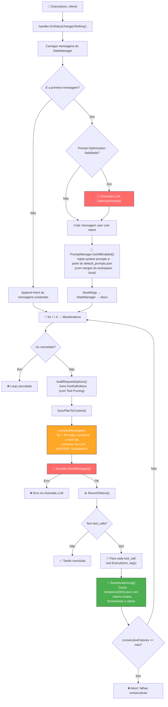
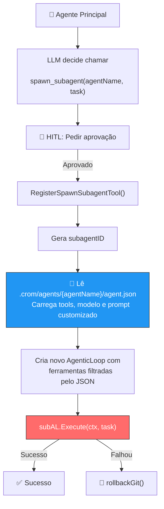
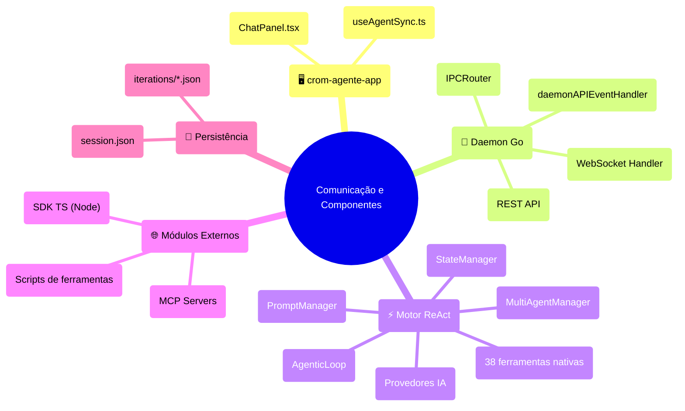

# 🏗️ Análise Arquitetural Profunda — crom-agente

## 📦 Estrutura de Pacotes

```
crom-agente/
├── cmd/
│   ├── crom-agente/       # Entry point do daemon
│   └── crom-agente-cli/   # Entry point da CLI
├── internal/
│   ├── blackbox/          # Módulo de caixa preta (testes isolados)
│   ├── cli/               # Lógica da CLI interativa
│   ├── cli-tui/           # TUI (Text User Interface)
│   ├── config/             # Sistema de configuração e PromptManager
│   │   └── assets/        # default_prompts.json
│   ├── cron/              # Tarefas agendadas
│   ├── daemon/            # Daemon HTTP + WebSocket + gRPC
│   ├── llm/               # Abstração de provedores de IA
│   ├── loop/              # Motor ReAct (coração do sistema)
│   ├── mcp/               # Protocol MCP (Model Context Protocol)
│   ├── orchestrator/      # Multi-Agente Manager
│   ├── permission/        # HITL (Human-in-the-Loop) Permissions
│   ├── security/          # Redação de dados sensíveis
│   ├── state/             # Persistência de estado (sessões e IterationLogs)
│   └── tools/             # 38 ferramentas nativas
├── pkg/
│   ├── config/            # Config pública para SDK
│   └── sdk/               # SDK programático para agentes
├── scripts/               # Scripts auxiliares
└── tests/                 # Testes de integração
```

---

## 🔄 Fluxograma 1: Loop ReAct Principal (Agente)

O `AgenticLoop.Execute()` segue o padrão **ReAct** (Reason + Act). Com as recentes refatorações, o loop incorpora logs granulares, gerenciamento de prompts via JSON e sumarização inteligente.



---

## 🔄 Fluxograma 2: Criação e Execução de Subagente (Dinâmico)



---

## 🔄 Fluxograma 3: Comunicação Frontend ↔ Daemon ↔ Agente



---

## 📋 Mapeamento de Prompts e Centralização (Refatorado)

Historicamente os prompts eram "hardcoded" em Go. Na arquitetura atual, eles foram **centralizados em JSON** gerenciados pelo `PromptManager`:

- **Assets Base**: Os prompts padrão residem em `internal/config/assets/default_prompts.json` (embutido no binário via `//go:embed`).
- **Overrides de Workspace**: O `PromptManager` lê automaticamente `.crom/prompts.json` na raiz do workspace para sobrescrever prompts, permitindo que a CLI ou o SDK modifiquem o comportamento base em tempo de execução.

**Estrutura do JSON (`default_prompts.json`)**:
```json
{
  "version": "1.0",
  "prompts": {
    "agentic_identity": { "id": "SYSTEM_AGENTIC_IDENTITY", "enabled": true, "content": "..." },
    "planning_requirement": { "id": "SYSTEM_PLANNING_REQUIREMENT", "enabled": true, "content": "..." },
    "tool_usage": { "id": "SYSTEM_TOOL_USAGE_REQUIREMENT", "enabled": true, "content": "..." }
  },
  "overrides": {}
}
```

---

## 🚀 Otimizações de Performance e Tokens Implementadas

| Componente | Otimização Aplicada | Impacto |
|---|---|---|
| **System Prompts** | Prompts redundantes consolidados via `PromptManager`. | Economia fixa de overhead por requisição. |
| **Histórico Longo** | `compactMessages()` faz resumo via LLM (`SYSTEM HISTORY SUMMARY`) em vez de preservar todas as iterações ou cortá-las secamente. | Queda drástica no crescimento linear de tokens em loops longos (> 15 iterações). |
| **Tool Pruning** | Ferramentas de domínio super-específico (como `MCP`) são omitidas na iteração se o intento do usuário não referenciá-las. | Economia de ~500 a 1000 tokens em *Tool Definitions* por request. |
| **Logs de Observabilidade** | A struct `IterationLog` salva o consumo *real* de tokens (Prompt, Completion, Total) devolvido pelo provedor LLM em `.crom/sessions/.../iterations/{00x}.json`. | Permite debugging financeiro granular. |
| **Subagentes Dinâmicos** | Instanciação de subagente não clona mais todas as ferramentas. Lê `agent.json` que restringe o escopo de tools (ex: um subagente "tester" só precisa de `run_tests`). | Maior segurança, menos alucinação e altíssima economia de tokens no loop interno do subagente. |
