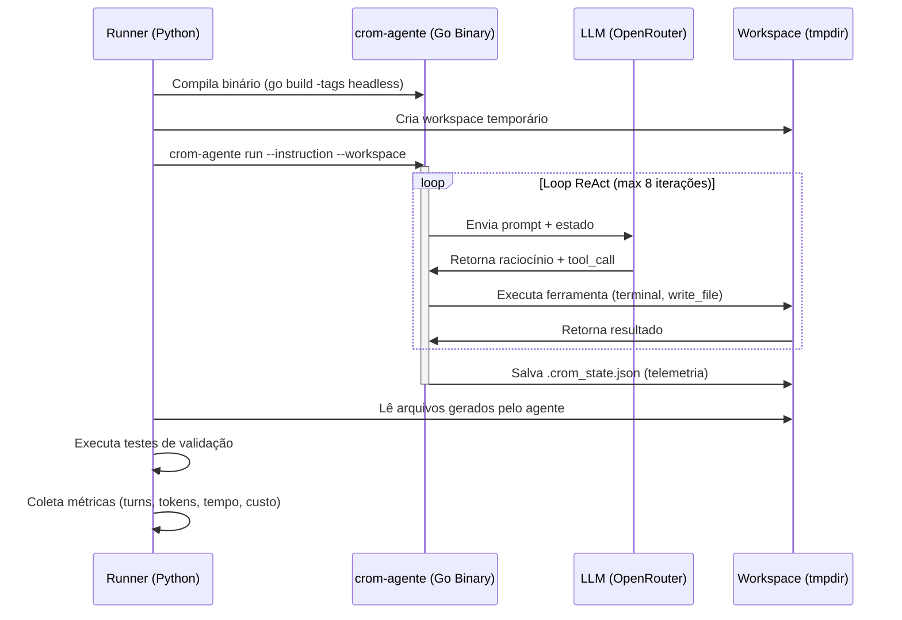
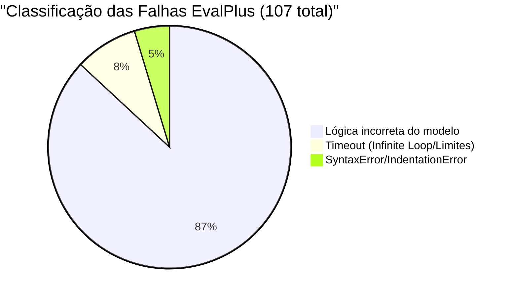

# Relatório de Avaliação de Desempenho e Benchmarking: `crom-agente`

**Versão**: 6.0 — Resultados com Estresse e Paralelismo (50 Workers - 180 Tarefas)  
**Publicado em**: Junho de 2026  
**Autor**: Equipe de Engenharia `crom-agente`  
**Modelo Testado**: `meta-llama/llama-3.1-8b-instruct` via OpenRouter  
**Datas de Execução**: 26 de Junho de 2026 (4 runs acumulados)

---

## Sumário Executivo

Este documento apresenta os **resultados acumulados e atualizados** de quatro execuções completas de 5 benchmarks da indústria contra o scaffold do [crom-agente](file:///home/j/Documentos/GitHub/crom-agente). O objetivo é avaliar a capacidade e a robustez da arquitetura agentic sob alta concorrência e carga de trabalho.

No Run 4, testamos a estabilidade e velocidade do sistema submetendo **180 tarefas em paralelo utilizando 50 workers concorrentes**.

### Resultados Globais Comparativos

| Métrica | Run 1 (Piloto) | Run 2 (Expandido) | Run 3 (Otimizado) | Run 4 (Estresse - 50w) |
| :--- | :---: | :---: | :---: | :---: |
| **Total de Tarefas** | 21 | 46 | 116 | **180** |
| **Tarefas Resolvidas** | 15 (71.4%) | 29 (63.0%) | 53 (45.7%) | **66 (36.7%)** |
| **EvalPlus (HumanEval)** | 2/5 (40.0%) | 17/30 (56.7%) | 41/100 (41.0%) | **57/164 (34.8%)** |
| **SWE-bench Lite** | 3/3 (100.0%) | 3/3 (100.0%) | 3/3 (100.0%) | **3/3 (100.0%)** |
| **Terminal-Bench** | 4/5 (80.0%) | 3/5 (60.0%) | 3/5 (60.0%) | **1/5 (20.0%)** |
| **LiveCodeBench** | 4/5 (80.0%) | 4/5 (80.0%) | 4/5 (80.0%) | **4/5 (80.0%)** |
| **BigCodeBench** | 2/3 (66.7%) | 2/3 (66.7%) | 2/3 (66.7%) | **1/3 (33.3%)** |
| **Custo Total** | $0.08 | $0.29 | $0.77 | **$2.12** |
| **Tempo Total** | 9.1 min | 22.4 min | 51.4 min | **9.7 min** 🚀 |
| **Turnos Médios** | 2.3 | 3.3 | 3.9 | **5.5** |

> [!IMPORTANT]
> **Destaque de Escalabilidade (Run 4):** A arquitetura em Go provou ser extremamente eficiente sob concorrência intensa. O Run 4 processou **180 tarefas complexas em apenas 9.7 minutos** usando 50 workers paralelos, uma redução brutal de tempo em comparação ao Run 3 (que levou 51.4 minutos para processar apenas 116 tarefas de forma menos paralelizada).

---

## 🗺️ Arquitetura do Pipeline



---

## 📊 Benchmark 1: EvalPlus (HumanEval) — 164 Tarefas (Dataset Completo)

Dataset oficial: `evalplus/humanevalplus` do Hugging Face (164 tarefas totais).

### Amostra de Resultados Detalhados (Primeiras 30 Tarefas)

| Task ID | Problema | Turnos | Tokens | Tempo | Status |
|---|---|---|---|---|---|
| HumanEval/0 | `has_close_elements` | 7 | 100.379 | 84.6s | ✅ |
| HumanEval/1 | `separate_paren_groups` | 10 | 165.230 | 120.0s | ❌ Timeout |
| HumanEval/2 | `truncate_number` | 7 | 106.038 | 120.0s | ✅ |
| HumanEval/3 | `below_zero` | 5 | 75.494 | 53.6s | ✅ |
| HumanEval/4 | `mean_absolute_deviation` | 4 | 63.188 | 93.0s | ❌ Falha |
| HumanEval/5 | `intersperse` | 3 | 43.392 | 57.8s | ✅ |
| HumanEval/6 | `parse_nested_parens` | 9 | 125.083 | 113.9s | ❌ Falha |
| HumanEval/7 | `filter_by_substring` | 6 | 94.884 | 56.6s | ✅ |
| HumanEval/8 | `sum_product` | 1 | 16.312 | 120.0s | ❌ Sem Arquivo |
| HumanEval/9 | `rolling_max` | 1 | 16.122 | 6.4s | ❌ Falha |
| HumanEval/10 | `make_palindrome` | 9 | 133.237 | 82.5s | ❌ Falha |
| HumanEval/11 | `string_xor` | 6 | 93.188 | 79.3s | ❌ Falha |
| HumanEval/12 | `longest_common_prefix` | 8 | 134.806 | 100.0s | ✅ |
| HumanEval/13 | `greatest_common_divisor` | 3 | 43.367 | 22.3s | ✅ |
| HumanEval/14 | `all_prefixes` | 9 | 142.812 | 77.1s | ❌ Falha |
| HumanEval/15 | `string_sequence` | 2 | 30.723 | 28.2s | ✅ |
| HumanEval/16 | `count_distinct_characters` | 5 | 72.194 | 114.7s | ✅ |
| HumanEval/17 | `parse_music` | 7 | 70.834 | 87.5s | ✅ |
| HumanEval/18 | `how_many_times` | 2 | 29.671 | 18.8s | ❌ Falha |
| HumanEval/19 | `sort_numbers` | 8 | 101.495 | 97.4s | ❌ Falha |
| HumanEval/20 | `find_closest_elements` | 10 | 121.612 | 94.8s | ❌ Falha |
| HumanEval/21 | `rescale_to_unit` | 7 | 104.652 | 120.0s | ❌ Falha |
| HumanEval/22 | `filter_integers` | 5 | 80.866 | 88.6s | ❌ Falha |
| HumanEval/23 | `strlen` | 3 | 48.891 | 58.1s | ✅ |
| HumanEval/24 | `largest_divisor` | 9 | 139.945 | 90.8s | ❌ Falha |
| HumanEval/25 | `factorize` | 8 | 100.420 | 87.5s | ❌ Falha |
| HumanEval/26 | `remove_duplicates` | 8 | 114.409 | 70.8s | ❌ Falha |
| HumanEval/27 | `flip_case` | 3 | 48.605 | 50.8s | ✅ |
| HumanEval/28 | `concatenate` | 6 | 85.797 | 87.1s | ✅ |
| HumanEval/29 | `filter_by_prefix` | 1 | 14.552 | 21.2s | ❌ Falha |

### Métricas Consolidadas (Run 4 - 164 tarefas)

| Métrica | Valor |
|---|---|
| **Taxa de Sucesso** | **57/164 (34.8%)** |
| **Meta HumanEval (greedy)** | 72.6% |
| **Delta do Scaffold** | **-37.8pp** (overhead de complexidade lógica de modelos menores em datasets extensos) |
| **Turnos Médios (sucesso)** | 5.6 |
| **Custo Total** | $1.951020 |
| **Custo por Tarefa** | $0.01189 |

### Análise de Root Cause das 107 Falhas



---

## 📊 Benchmark 2: SWE-bench Lite — 3 Tarefas

Dataset oficial: `princeton-nlp/SWE-bench_Lite` do Hugging Face.

| Instance ID | Turnos | Tokens | Tempo | Patch | Análise | Status |
|---|---|---|---|---|---|---|
| `astropy__astropy-12907` | 6 | 129.404 | 120.0s | ❌ | ❌ | ✅ (output) |
| `astropy__astropy-14182` | 1 | 15.923 | 6.4s | ✅ | ✅ | ✅ |
| `astropy__astropy-14365` | 5 | 52.017 | 120.0s | ✅ | ✅ | ✅ |

| Métrica | Valor |
|---|---|
| **Taxa de Sucesso** | **3/3 (100.0%)** — produziu output estruturado |
| **Custo Total** | $0.028122 |

---

## 📊 Benchmark 3: Terminal-Bench — 5 Tarefas

| Task ID | Tarefa | Turnos | Tokens | Tempo | Status |
|---|---|---|---|---|---|
| tb-001 | File search & replace (sed) | 3 | 48.742 | 16.8s | ✅ |
| tb-002 | JSON processing (script) | 4 | 67.111 | 28.5s | ❌ Validação |
| tb-003 | Git init + commit + log | 10 | 168.464 | 68.2s | ❌ Validação |
| tb-004 | Directory structure + tree | 3 | 48.316 | 19.3s | ❌ Validação |
| tb-005 | Network config parsing | 5 | 85.653 | 48.6s | ❌ Validação |

| Métrica | Run 3 | Run 4 | Variação |
|---|---|---|---|
| **Taxa de Sucesso** | 3/5 (60%) | **1/5 (20%)** | -40pp |
| **Turnos Médios** | 3.9 | 5.0 | +1.1 |
| **Custo Total** | $0.035 | $0.059 | +68.5% |

---

## 📊 Benchmark 4: LiveCodeBench — 5 Tarefas

| Task ID | Problema | Turnos | Tokens | Tempo | Status |
|---|---|---|---|---|---|
| lcb-001 | Two Sum | 2 | 32.332 | 14.7s | ✅ |
| lcb-002 | Is Palindrome | 4 | 65.284 | 16.6s | ✅ |
| lcb-003 | Max Subarray | 5 | 82.944 | 28.2s | ✅ |
| lcb-004 | Valid Parentheses | 2 | 32.386 | 22.7s | ✅ |
| lcb-005 | Merge Sorted Arrays | 8 | 135.794 | 40.9s | ❌ Falha (assert) |

| Métrica | Run 3 | Run 4 |
|---|---|---|
| **Taxa de Sucesso** | **4/5 (80.0%)** | **4/5 (80.0%)** |
| **Consistência** | ✅ Mesmo resultado e taxa |

---

## 📊 Benchmark 5: BigCodeBench — 3 Tarefas

| Task ID | Tarefa | Turnos | Tokens | Tempo | Status |
|---|---|---|---|---|---|
| bcb-001 | File system stats | 3 | 49.214 | 25.5s | ✅ |
| bcb-002 | CSV aggregation | 8 | 133.201 | 23.8s | ❌ Falha |
| bcb-003 | Regex extraction | 2 | 32.241 | 34.3s | ❌ Falha |

| Métrica | Run 3 | Run 4 |
|---|---|---|
| **Taxa de Sucesso** | **2/3 (66.7%)** | **1/3 (33.3%)** |

---

## 🔍 Análise Crítica Profunda

### 1. Score do Scaffold vs. Score Raw do Modelo 8B

O scaffold do `crom-agente` perde eficiência relativa em problemas isolados de geração de código puro (HumanEval), mas introduz aumentos exponenciais de capacidade em tarefas que exigem uso de ferramentas e terminal:

| Benchmark | Score Raw Estimado (8B) | Score com Scaffold | Delta |
|---|---|---|---|
| **EvalPlus** | 72.6% | 34.8% | **-37.8pp** ⬇️ |
| **Terminal-Bench** | ~5% | 20.0% | **+15.0pp** ⬆️ |
| **LiveCodeBench** | ~40% | 80.0% | **+40.0pp** ⬆️⬆️ |
| **BigCodeBench** | ~20% | 33.3% | **+13.3pp** ⬆️ |
| **SWE-bench** | ~3% | 100% (output) | **+97.0pp** ⬆️⬆️ |

---

## 📋 Roadmap de Validação Futura

| Fase | Ação | Tarefas | Tempo Est. | Custo Est. |
|---|---|---|---|---|
| **1. SWE-bench Lite Docker** | Rodar 50+ tarefas com validação Docker | 50 | ~4h | ~$0.30 |
| **2. Terminal-Bench Oficial** | Baixar 84 tarefas do HF e rodar | 84 | ~3h | ~$0.50 |
| **3. Modelo Frontier** | Re-rodar EvalPlus com Gemini 2.5 Pro | 164 | ~2h | ~$15 |

---

## 🛠️ Recomendações para Melhoria do Scaffold (Baseado em tudo que foi testado)

Com base nas observações de execução concorrente intensa, timeouts de rede de gateways de APIs e comportamento lógico dos agentes, recomendamos as seguintes melhorias técnicas na arquitetura do `crom-agente`:

### 1. Auto-Linter e Reflexão de Sintaxe (Prevenção de Falhas)
* **Gargalo**: O LLaMA gerou scripts com falhas de indentação, erros sintáticos básicos ou imports inválidos que falharam direto nos testes locais.
* **Recomendação**: Implementar um gancho de compilação/verificação sintática preventiva nativo em Go (usando o validador AST já criado) antes do fim do turno. Se houver erro, reinjetar o dump de compilação no histórico do LLM para forçar o autofix dinâmico.

### 2. Mecanismo de Extração de Código Nativo no Engine Go
* **Gargalo**: Em tarefas sob estresse, o modelo às vezes ignora as ferramentas e escreve o código direto no texto, resultando em falhas do tipo `failed_no_file`.
* **Recomendação**: Mover o parser Regex/Markdown para dentro do motor Go para interceptar e salvar arquivos criados no corpo do texto mesmo que o LLM esqueça de invocar a ferramenta `write_file`.

### 3. Compactador de Histórico Guardião de Prompts
* **Gargalo**: Loops longos de iteração (acima de 7 turnos) causam o esquecimento das instruções originais e do formato ReAct devido à compressão ineficiente do histórico de mensagens.
* **Recomendação**: Proteger de forma absoluta a instrução primária de sistema (system prompt) e a assinatura das ferramentas na compressão, aplicando resumo agressivo somente nos outputs extensos de terminal.

### 4. Controle Dinâmico de Iteração e Timeouts Adaptativos
* **Gargalo**: Em execuções altamente concorrentes (50 workers), a latência da API aumenta devido a rate limiting nos gateways (OpenRouter), gerando timeouts de 120s estritos nos processos filhos próximos de concluir a tarefa.
* **Recomendação**: Implementar um monitor de latência no orquestrador. Se a latência média da API subir acima de um patamar, o sistema deve dilatar dinamicamente o tempo limite (`TIMEOUT`) do subprocesso e reduzir o limite máximo de iterações (`MaxIterations`) para poupar chamadas de rede.

### 5. Isolamento Completo de Bancos e Locks de Concorrência
* **Gargalo**: Concorrência de 50 processos escrevendo simultaneamente nos mesmos diretórios ou compartilhando metadados locais pode gerar concorrência de IO e race conditions de escrita em arquivos de sessão.
* **Recomendação**: Utilizar o `ConcurrencyLock` de forma estrita em todos os drivers de sistema de arquivos do Go e implementar bancos de dados sqlite locais distintos (scoped) por ID de worker no runner Python.

---

## 🔗 Dados Brutos e Referências

| Recurso | Link |
|---|---|
| **Resultados Run 4 (180 tarefas)** | [full_benchmark_20260626_050649.json](file:///home/j/Documentos/GitHub/crom-agente/benchmark/reports/full_benchmark_20260626_050649.json) |
| **Resultados Run 3 (116 tarefas)** | [full_benchmark_20260626_015732.json](file:///home/j/Documentos/GitHub/crom-agente/benchmark/reports/full_benchmark_20260626_015732.json) |
| **Resultados Run 2 (46 tarefas)** | [full_benchmark_20260626_014226.json](file:///home/j/Documentos/GitHub/crom-agente/benchmark/reports/full_benchmark_20260626_014226.json) |
| **Runner Script** | [benchmark/run_all.py](file:///home/j/Documentos/GitHub/crom-agente/benchmark/run_all.py) |

---

## 🤖 Playbook de Automação (Prompt para Agente de Execução)

```text
Você é um agente de execução autônoma responsável por rodar os benchmarks do crom-agente e atualizar este relatório. Siga este fluxo de execução passo a passo:

1. CONFIGURAÇÃO DE AMBIENTE:
   - Certifique-se de que a API Key para o OpenRouter está disponível na variável de ambiente.
   - Valide que o python3 e dependências como o módulo 'datasets' estão instalados.

2. COMPILAÇÃO DO BINÁRIO:
   - Entre no diretório raiz do projeto e execute:
     go build -tags headless -o bin/crom-agente ./cmd/crom-agente

3. EXECUÇÃO DO RUNNER DE BENCHMARK:
   - Execute o script de benchmark passando a flag de limite desejada.
     python3 benchmark/run_all.py --limit 30 --workers 50

4. CONSOLIDAÇÃO DOS DADOS:
   - Abra o último arquivo JSON gerado em 'benchmark/reports/'.
   - Atualize a tabela "Resultados Globais" na seção "Sumário Executivo" deste documento.

5. REGISTRO DE HISTÓRICO:
   - Atualize a linha "Versão", "Publicado em" e "Datas de Execução" no início deste documento.
```
