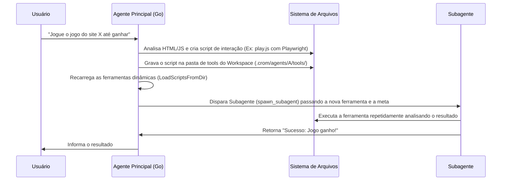
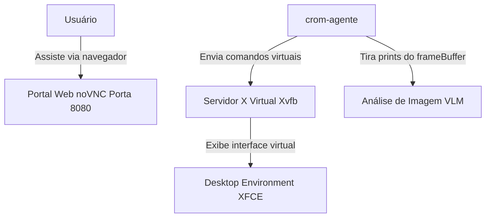

# Proposta de Design: Automação de Navegador (Browser) e Controle de Interface Gráfica (Computer Use / GUI)

Este documento descreve a viabilidade, a arquitetura e o design técnico para estender o **`crom-agente`** com capacidades de automação de navegador (Browser Use) e controle de computadores locais/remotos (GUI Automation / Computer Use).

---

## 🌐 1. Criação Dinâmica de Ferramentas e Subagentes

Sim, o `crom-agente` **consegue criar suas próprias ferramentas e delegá-las a subagentes**. Graças à flexibilidade das goroutines do Go e ao carregamento dinâmico de scripts, o fluxo funciona da seguinte forma:



### Mecanismo de Integração MCP Dinâmico
1. O agente principal cria uma API leve ou script local (Ex: Python/Node).
2. O agente expõe esse script via um arquivo JSON de configuração de ferramenta local (como os esquemas JSON de parâmetros).
3. O subagente consome esse esquema, enviando chamadas estruturadas que executam o script em segundo plano.

---

## 🖥️ 2. Automação de Navegador (Browser Capability)

A automação de navegador permite interagir com páginas modernas SPA (React, Vue), resolver captchas, clicar em botões complexos e raspar dados dinâmicos.

### A. Modos de Execução do Browser
Configuráveis via `config.json` do workspace ou argumentos da CLI:

1. **`headless` (Modo Background)**:
   * O navegador roda sem interface gráfica (ótimo para CI/CD ou servidores Linux headless).
   * Utiliza bibliotecas em Go puro como `chromedp` ou `go-rod` para controlar o Chromium.
2. **`headed` (Modo Visível)**:
   * Abre uma janela física do navegador na máquina do usuário para que ele acompanhe visualmente as interações (cliques, digitações).
3. **`interactive` (Modo TUI / REPL)**:
   * Permite que o usuário digite `/browser open <url>` no REPL.
   * O agente consegue gerar "snapshots" visuais (capturas de tela) e renderizar no terminal ou fornecer o link para o usuário visualizar.

### B. Exemplo de Ferramenta em Go (`browser_automation.go`)
Usando `github.com/go-rod/rod` para interagir nativamente com o Chromium:

```go
type BrowserTool struct {
    browser *rod.Browser
    page    *rod.Page
}

func (b *BrowserTool) Execute(ctx context.Context, args json.RawMessage) (tools.Result, error) {
    // Exemplo de argumentos: {"action": "click", "selector": "#start-game"}
    // 1. Inicializa o browser headed ou headless
    // 2. Localiza o elemento e clica
    // 3. Tira screenshot para enviar ao VLM (se necessário)
}
```

---

## 🖱️ 3. Controle de Computador Local/Remoto (Computer Use / GUI Automation)

Para rodar aplicativos desktop que não estão no navegador (editores, IDEs, jogos nativos) ou interagir diretamente com o sistema operacional, propomos a integração de ferramentas de **Controle de GUI**.

### A. Controle Local (Direct OS Control)
O agente utiliza ferramentas que simulam inputs de teclado e mouse nativos do sistema operacional:
* **Biblioteca Go**: `github.com/go-vgo/robotgo` (permite ler pixels da tela, mover o mouse, clicar e simular teclado no Windows, Mac e Linux).
* **Fluxo Cognitivo com VLM (Vision-Language Models)**:
  1. O agente captura uma imagem da tela ativa.
  2. Envia a imagem para um modelo multimodal (como o `gemini-2.5-flash` ou `claude-3-7-sonnet`).
  3. A IA retorna as coordenadas lógicas de tela `(x, y)` do botão a ser clicado.
  4. O agente aciona a ferramenta para mover o mouse até `(x, y)` e clicar.

### B. Controle Remoto Seguro (Sandbox Isolada via Docker VNC) - **RECOMENDADO**
Para evitar que o agente tome o controle físico do mouse do usuário e faça estragos acidentais (ou feche o próprio terminal), a melhor prática é rodar a interface em um **Desktop Virtual Isolado em Container**:



1. **Estrutura do Container**: Um container Linux contendo um servidor X virtual (`Xvfb`), um ambiente de desktop leve (`XFCE`), um servidor VNC (`x11vnc`) e um cliente web (`noVNC`).
2. **Isolamento**: O agente opera livremente com teclado e mouse virtuais dentro deste container sem interferir no computador host do usuário.
3. **Monitoramento**: O usuário pode abrir a porta `http://localhost:8080` no seu próprio navegador para assistir o agente "jogando o jogo" ou operando o aplicativo remoto em tempo real.
