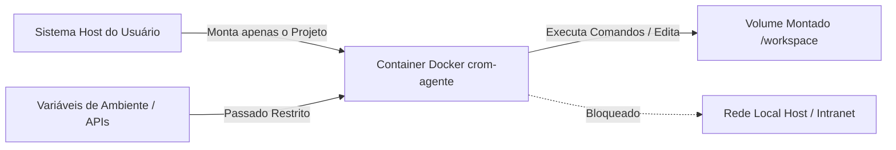

# Diretrizes e Boas Práticas de Segurança

A segurança é um pilar fundamental no design do **`crom-agente`**. Por ser um agente autônomo com capacidades de ler e gravar arquivos e executar comandos no terminal, foram estabelecidas múltiplas camadas de proteção. 

Este documento descreve as práticas recomendadas e as camadas de isolamento implementadas, com foco especial no **isolamento de containers (Docker)**.

---

## 🔒 1. Camadas de Segurança Nativas

O orquestrador implementa três barreiras automáticas por padrão:

1. **Jail/Sandbox do Workspace (`ValidatePath`)**:
   * Impede ataques de *Path Traversal*. Qualquer arquivo acessado pelas ferramentas (`read_file`, `write_file`, etc.) deve resolver estritamente para dentro do diretório do workspace registrado.
   * Tentativas de acessar `/etc/...` ou caminhos relativos como `../../...` são bloqueadas imediatamente.
2. **Mascaramento de Dados Sensíveis (`redactor.go`)**:
   * Sanitização em tempo real de logs de execução e outputs.
   * Filtra automaticamente chaves de API conhecidas (OpenAI, Anthropic, Gemini, OpenRouter), tokens JWT, e credenciais de banco de dados, substituindo-as pela string `***REDACTED***`.
3. **Manejo de Permissões HITL (Human In The Loop)**:
   * Três modos de permissão por workspace configuráveis via CLI ou arquivo de configuração:
     * `total_access`: Para automações em ambientes controlados e isolados.
     * `ask_every_time`: Estrito. Qualquer ação de escrita ou terminal exige aprovação do usuário.
     * `scoped_permissions`: Pergunta uma vez para um determinado recurso e armazena a aprovação.

---

## 🐳 2. Isolamento Adicional via Containers (Docker)

Embora o sandbox do workspace proteja contra acesso a caminhos fora do projeto, a execução de ferramentas de terminal (como `go test`, `npm install`, ou scripts arbitrários sugeridos pelo LLM) roda diretamente no sistema operacional do usuário. 

Para **isolamento absoluto contra comandos destrutivos ou maliciosos**, recomenda-se executar o `crom-agente` dentro de uma sandbox baseada em Docker.

### A. Fluxo de Execução Isolada
Quando rodando em container, o código fonte do usuário e as credenciais necessárias são passadas de forma restrita, garantindo que o agente não tenha acesso ao host principal:



### B. Criando o Dockerfile de Sandbox
Recomenda-se criar uma imagem que empacote o compilador do Go (ou a stack do seu projeto) junto com o binário do `crom-agente`.

Exemplo de `Dockerfile.sandbox`:
```dockerfile
FROM golang:1.21-alpine

# Instala dependências de ferramentas e git
RUN apk add --no-cache git bash build-base

# Define diretório de trabalho padrão do container
WORKDIR /workspace

# Copia o binário previamente compilado do crom-agente para a sandbox
COPY ./bin/crom-agente /usr/local/bin/crom-agente

# Executa o daemon por padrão
ENTRYPOINT ["crom-agente"]
CMD ["daemon", "start"]
```

### C. Rodando a Sandbox com Limitações de Recursos e Rede
Ao disparar a imagem docker do agente, aplique restrições adicionais para limitar o consumo de CPU, memória e acessos de rede à intranet local:

```bash
docker run -d \
  --name crom-sandbox \
  # Limita consumo de CPU e Memória
  --memory="2g" \
  --cpus="2.0" \
  # Monta apenas o diretório do projeto alvo
  -v /home/j/Área de trabalho/GitHub/meu-projeto:/workspace \
  # Passa chaves de API como ENVs
  -e OPENROUTER_API_KEY=$OPENROUTER_API_KEY \
  # Executa o daemon escutando na porta do container
  -p 9090:9090 \
  -p 9091:9091 \
  crom-sandbox-image
```

---

## 🛡️ 3. Boas Práticas Recomendadas

1. **Nunca versione a pasta `.crom`**:
   * O diretório `.crom` dentro de cada workspace armazena o histórico da sessão e permissões concedidas (`permissions.json`). Mantenha-o listado no `.gitignore`.
2. **Restrinja o escopo de rede**:
   * Se o container não necessita acessar a internet (caso utilize modelos locais via Ollama), rode com a flag `--network none`.
3. **Execute como usuário não-root**:
   * No Dockerfile, evite rodar sob a conta root. Crie um usuário comum (ex: `developer`) e configure o `USER developer` para mitigar escalonamento de privilégios em caso de vulnerabilidades na stack do projeto.
4. **Revise Diffs antes de aprovar**:
   * Mesmo em modo `scoped_permissions`, certifique-se de visualizar a diff zone (verde/vermelho) gerada pelo CLI antes de prosseguir com comandos de terminal críticos ou escritas complexas.
