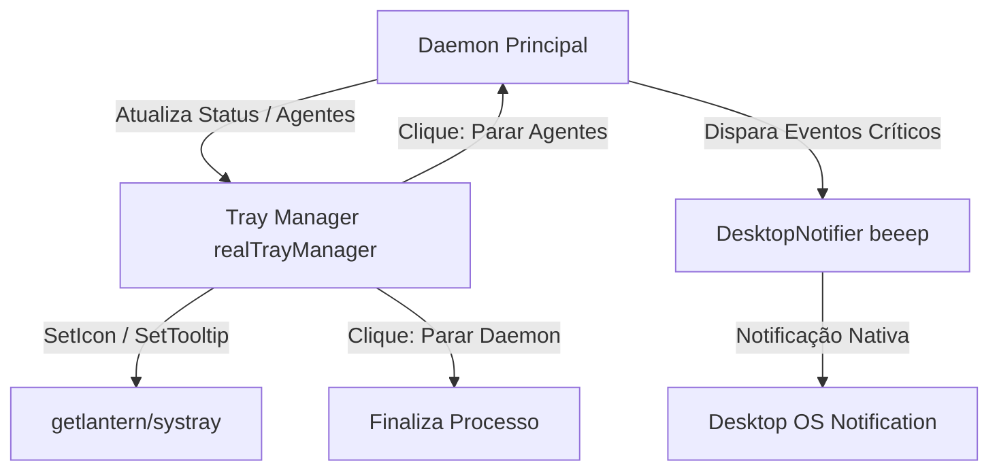

# Guia do System Tray e Notificações Desktop

O **`crom-agente`** conta com um daemon de segundo plano persistente que inclui uma interface visual discreta na bandeja do sistema (System Tray) para plataformas Linux, macOS e Windows. Este guia documenta o funcionamento, os estados visuais, a estrutura de menus e a integração de notificações desktop nativas.

---

## 🛠️ 1. Visão Geral e Arquitetura

Para manter o orquestrador leve e modular, a interface de bandeja é compilada apenas quando suporte a CGO e tags gráficas estão presentes (`!headless && cgo`). 



* **Interface Abstrata (`tray_interface.go`)**: Permite que o daemon compile e execute perfeitamente em ambientes de servidor headless (onde os stubs desativam qualquer chamada gráfica).
* **Bandeja Nativa (`getlantern/systray`)**: Biblioteca leve em Go para controle multiplataforma do menu de bandeja.
* **Notificador Nativa (`gen2brain/beeep`)**: Responsável pelo disparo de notificações *push* desktop (balões de notificação do Windows, notificações do macOS e notificações via `notify-send` / DBus no Linux).

---

## 🟢 2. Estados e Ícones da Bandeja

O ícone da bandeja é gerado dinamicamente via buffers PNG sólidos ou carregado a partir de recursos estáticos, mudando de cor conforme o estado do orquestrador:

| Estado do Daemon | Cor do Ícone | Significado |
|:---|:---|:---|
| **🟢 Verde** | `color.RGBA{0, 200, 0, 255}` | **Ativo (Idle)**: O daemon está online, escutando gRPC/WebSockets e pronto para receber tarefas. |
| **🔵 Azul** | `color.RGBA{0, 122, 255, 255}` | **Executando**: Há pelo menos um agente executando tarefas ou em loop ReAct ativo. |
| **🔴 Vermelho** | `color.RGBA{255, 59, 48, 255}` | **Erro**: O daemon ou algum dos agentes encontrou uma falha fatal (porta travada, timeout de API de LLM persistente, etc.). |

---

## 📋 3. Estrutura do Menu de Contexto (Mockup Visual)

Ao clicar com o botão direito (ou esquerdo, dependendo do OS) sobre o ícone do `crom-agente`, o seguinte menu de contexto é exibido:

```text
┌────────────────────────────────────────┐
│ 🤖 crom-agente                         │  <- Desabilitado (Título)
│ Estado: 🟢 Ativo (Idle)                │  <- Desabilitado (Status Dinâmico)
├────────────────────────────────────────┤
│ Abrir Log de Execução                  │  <- Abre ~/.crom/daemon.log no editor padrão
│ Abrir Diretório do Workspace           │  <- Abre a pasta do projeto no File Manager (Explorer/Finder/Nautilus)
│ Parar Todos os Agentes                 │  <- Envia cancelamento para as goroutines ativas
├────────────────────────────────────────┤
│ Agentes Ativos:                        │  <- Desabilitado (Título da Seção)
│  🔹 analista-seguranca (Executando)    │  <- Ocultado/Exibido dinamicamente (Pool de 5)
│  🔹 refatorador-auth (Idle)            │  <- Ocultado/Exibido dinamicamente (Pool de 5)
├────────────────────────────────────────┤
│ Parar Daemon                           │  <- Encerra o daemon e limpa sockets/PIDs
└────────────────────────────────────────┘
```

---

## 🔔 4. Notificações Desktop Nativas

O daemon envia notificações visuais em eventos que requerem atenção imediata do usuário:

1. **Inicialização com Sucesso**: Dispara uma notificação ao subir o servidor HTTP, gRPC e WebSocket.
   * *Título*: `crom-agente`
   * *Mensagem*: `Daemon persistente inicializado com sucesso nas portas 9090 (API) e 9091 (gRPC)`
2. **Solicitação de Permissão (HITL)**: Quando um agente em segundo plano ou tarefa agendada via Cron bate em uma barreira de segurança estrita.
   * *Título*: `crom-agente — Permissão Pendente`
   * *Mensagem*: `O agente 'analista-seguranca' solicita autorização para a ação [delete_file] em 'main.go'.`
3. **Conclusão de Tarefa Agendada**: Quando um Cronjob termina sua execução.
   * *Título*: `crom-agente — Tarefa Concluída`
   * *Mensagem*: `Tarefa agendada 'scan-diario' finalizada com status: finished.`
4. **Erros Críticos**: Falhas na rede ou limites de tokens de LLM estourados.
   * *Título*: `crom-agente — Erro`
   * *Mensagem*: `Falha na requisição para OpenRouter: limite de cota mensal atingido.`

---

## ⚙️ 5. Inicialização Automática (Autostart)

O tray/daemon suporta configuração de inicialização automática ao ligar o computador. Ao executar `crom-agente daemon autostart --enable`, a ferramenta configura:

* **Linux**: Um arquivo `.desktop` em `~/.config/autostart/crom-agente.desktop` que executa o binário com a flag `--daemon`.
* **macOS**: Uma entrada de LaunchAgent em `~/Library/LaunchAgents/com.crom.agente.plist`.
* **Windows**: Um atalho `.lnk` no diretório de inicialização do usuário (Startup folder): `AppData\Roaming\Microsoft\Windows\Start Menu\Programs\Startup`.
