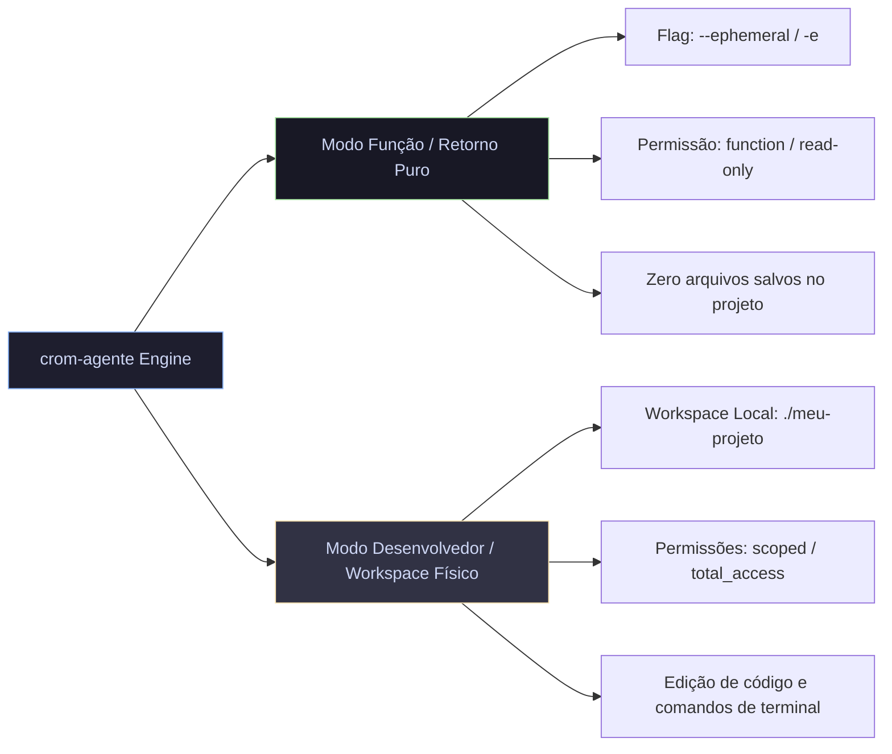

# 🚀 01. Modos de Execução no `crom-agente`

Este documento detalha os modos de execução do **`crom-agente`**, abordando a flag nativa `--ephemeral` (`-e`), o modo de permissão de segurança `permission_mode: "function"` (read-only) e o comparativo entre o **Modo Função (Execução Isolada)** e o **Modo Desenvolvedor (Com Workspace Físico)**.

---

## 📑 Sumário
1. [Visão Geral dos Modos de Execução](#1-visão-geral-dos-modos-de-execução)
2. [O Workspace Efêmero (`--ephemeral` / `-e`)](#2-o-workspace-efêmero---ephemeral----e)
3. [Perfil de Segurança `permission_mode: "function"`](#3-perfil-de-segurança-permission_mode-function)
4. [Comparativo: Modo Função vs Modo Desenvolvedor](#4-comparativo-modo-função-vs-modo-desenvolvedor)
5. [Exemplos Práticos de Uso em CLI, Go e TypeScript](#5-exemplos-práticos-de-uso-em-cli-go-e-typescript)

---

## 1. Visão Geral dos Modos de Execução

O `crom-agente` foi projetado para operar em dois ambientes fundamentais:



---

## 2. O Workspace Efêmero (`--ephemeral` / `-e`)

### O que é?
A flag `--ephemeral` (`-e`) permite executar tarefas autônomas em um ambiente **100% isolado**. Por baixo dos panos, o `crom-agente` cria um diretório temporário no sistema operacional (`/tmp/crom-ephemeral-*`) e garante a sua **remoção completa** assim que a tarefa é finalizada.

### Benefícios:
- **Segurança**: Garante que o agente não altere nenhum arquivo do seu repositório local.
- **Zero Poluição**: Impede a criação de arquivos soltos como `.txt`, `.md`, logs temporários ou rascunhos.
- **Ideal para Microsserviços**: Perfeito para rodar em servidores backend onde o agente atua como processador de dados.

### Código Fonte no Engine Go (`internal/cli/root.go`):
```go
if cliEphemeral {
    tempWorkspace, err := os.MkdirTemp("", "crom-ephemeral-*")
    if err != nil {
        return fmt.Errorf("falha ao criar workspace efêmero: %w", err)
    }
    defer os.RemoveAll(tempWorkspace)
    workspacePath = tempWorkspace
    if cliPermissionMode == "" {
        cliPermissionMode = "function"
    }
}
```

---

## 3. Perfil de Segurança `permission_mode: "function"`

O `crom-agente` inclui o modo de permissão `function` (definido em [manager.go](file:///home/j/Documentos/GitHub/crom-agente/internal/permission/manager.go#L26)).

### Matriz de Autorização:

| Ação Solicitada pelo Agente | Status no Modo `function` | Motivo |
| :--- | :--- | :--- |
| `write_file` (Criar arquivo) | ❌ **BLOQUEADO** | Impede criação de arquivos |
| `edit_file` (Modificar arquivo) | ❌ **BLOQUEADO** | Impede alteração de código |
| `delete_file` (Deletar arquivo) | ❌ **BLOQUEADO** | Impede remoção de dados |
| `command` (Executar terminal bash) | ❌ **BLOQUEADO** | Impede execução de scripts no SO |
| `read_file` (Ler arquivo) | ✅ **PERMITIDO** | Permitido para leitura de contexto |
| `http_client` (Requisições Web) | ✅ **PERMITIDO** | Permitido para consultas HTTP |
| `mcp_*` (Conectores MCP) | ✅ **PERMITIDO** | Permitido para consulta a DB/APIs |

---

## 4. Comparativo: Modo Função vs Modo Desenvolvedor

| Característica | 🧪 Modo Função (Isolado) | 🛠️ Modo Desenvolvedor (Físico) |
| :--- | :--- | :--- |
| **Flag de CLI** | `--ephemeral` ou `-e` | Nenhuma (usa `--workspace .`) |
| **Caminho de Trabalho** | `/tmp/crom-ephemeral-*` (Removido pós-execução) | Pasta real do projeto (ex: `~/meu-projeto`) |
| **Permissão Padrão** | `function` / `read-only` | `scoped` ou `total_access` |
| **Operações de Escrita** | Desativadas (0 escritas em disco) | Habilitadas (Cria/Edita arquivos do projeto) |
| **Uso Recomendado** | APIs backend, automação de DB, microsserviços | Refatoração de código, testes unitários, lints |

---

## 5. Exemplos Práticos de Uso

### A. Linha de Comando (CLI)
```bash
# Execução efêmera isolada com limite de 3 iterações
crom-agente run "Classifique o texto: 'Gostei muito do serviço'" --ephemeral --max-iterations 3
```

### B. TypeScript (`@crom/agente-sdk`)
```typescript
import { CromAgentEngine } from "@crom/agente-sdk";

const engine = new CromAgentEngine({
  provider: "openrouter",
  model: "google/gemini-2.5-flash",
  ephemeral: true, // Ativa modo efêmero nativo
  toolsConfig: { mode: "none" } // Cadeia de pensamento pura (0 ferramentas)
});

const response = await engine.run("Analise e retorne apenas a polaridade: POSITIVO|NEGATIVO");
console.log(response.data);
```

### C. Go (`pkg/sdk`)
```go
package main

import (
	"context"
	"fmt"
	"os"

	"github.com/crom/crom-agente/pkg/sdk"
)

func main() {
	manager := sdk.NewManager()
	agent, _ := manager.CreateAgent(sdk.AgentConfig{
		AgentID:  "analisador-isolado",
		Provider: "openrouter",
		Model:    "google/gemini-2.5-flash",
	})

	// Usa o diretório efêmero do SO como workspace
	res, _ := agent.ExecuteTask(context.Background(), "Analise o payload X e retorne em formato JSON")
	fmt.Println(res.Summary)
}
```
