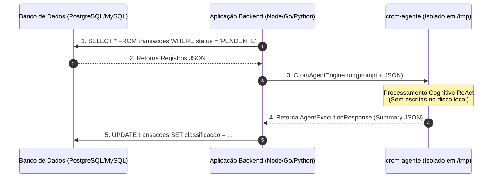

# 🗄️ 02. Uso Sem Workspace e Integração com Banco de Dados

Este documento aborda a arquitetura de uso do **`crom-agente`** como um **Motor Puro de Inferência e Raciocínio (Pure Inference Engine)**, integrando com bancos de dados e APIs sem gerar arquivos avulsos no sistema de arquivos.

---

## 📑 Sumário
1. [Conceito do Motor de Inferência Puro](#1-conceito-do-motor-de-inferência-puro)
2. [Fluxo de Dados: Banco de Dados $\rightarrow$ Agente $\rightarrow$ Banco de Dados](#2-fluxo-de-dados-banco-de-dados---agente---banco-de-dados)
3. [Formatando Entradas e Extraindo a Saída (`Summary`)](#3-formatando-entradas-e-extraindo-a-saída-summary)
4. [Padrões de Arquitetura de Microsserviços](#4-padrões-de-arquitetura-de-microsserviços)
5. [Exemplo Completo de Backend (Node.js + PostgreSQL)](#5-exemplo-completo-de-backend-nodejs--postgresql)

---

## 1. Conceito do Motor de Inferência Puro

Quando o `crom-agente` é utilizado em aplicações de backend (servidores web, processamento de filas, microsserviços), o objetivo primário não é alterar arquivos de código, mas sim **processar informações estruturadas**.



Neste modelo:
- **Entrada**: Dados passados diretamente na instrução da tarefa.
- **Processamento**: Ciclo ReAct isolado na RAM ou pasta efêmera `/tmp`.
- **Saída**: Dados estruturados obtidos no campo `Summary` da resposta.

---

## 2. Fluxo de Dados: Banco de Dados $\rightarrow$ Agente $\rightarrow$ Banco de Dados

### Por que evitar arquivos temporários no disco?
1. **Concorrência**: Múltiplos workers em um servidor backend podem colidir se tentarem ler/escrever no mesmo diretório.
2. **I/O Overhead**: Operações de leitura/escrita em disco aumentam a latência da requisição.
3. **Gerenciamento de Estado**: Banco de dados relacional ou NoSQL é a fonte da verdade da sua aplicação.

---

## 3. Formatando Entradas e Extraindo a Saída (`Summary`)

Para garantir que a LLM compreenda o payload e retorne estritamente um formato parseável, utiliza-se a seguinte estrutura de prompt e opções:

```typescript
const prompt = `
Você é uma função pura de processamento de dados.
PAYLOAD DE ENTRADA:
${JSON.stringify(registroBanco)}

INSTRUÇÕES:
- Analise os dados e retorne estritamente um JSON no formato:
  {"status": "APROVADO"|"REJEITADO", "score": number, "justificativa": "string"}
- Não inclua markdown fora do JSON.
`;

const response = await engine.run(prompt, { jsonResponse: true });
console.log(response.data.status);
```

---

## 4. Padrões de Arquitetura de Microsserviços

Existem dois padrões principais de consumo do `crom-agente` em sistemas distribuídos:

### Padrão A: SDK In-Process (Go / TypeScript)
O agente roda dentro do mesmo processo ou contêiner do seu serviço backend.

### Padrão B: Daemon IPC / HTTP Gateway
O processo daemon do `crom-agente` roda como um serviço de fundo (`systemd` ou Docker), e os microsserviços se comunicam com ele via chamadas HTTP REST ou gRPC.

---

## 5. Exemplo Completo de Backend (Node.js + PostgreSQL)

```typescript
import { CromAgentEngine } from "@crom/agente-sdk";
import { Client } from "pg";

// 1. Inicializa o cliente do Banco de Dados
const pgClient = new Client({ connectionString: process.env.DATABASE_URL });
await pgClient.connect();

// 2. Inicializa o crom-agente em modo função isolado (0 ferramentas de escrita)
const cromEngine = new CromAgentEngine({
  provider: "openrouter",
  model: "google/gemini-2.5-flash",
  ephemeral: true,
  toolsConfig: { mode: "none" } // Pensamento puro
});

interface AnaliseTransacao {
  status: "APROVADO" | "SUSPEITO" | "BLOQUEADO";
  scoreRisco: number;
  motivo: string;
}

export async function processarFilaTransacoes() {
  // Busca registro pendente no banco
  const res = await pgClient.query("SELECT * FROM transacoes WHERE status = 'PENDENTE' LIMIT 1");
  if (res.rows.length === 0) return;

  const transacao = res.rows[0];

  // Executa o raciocínio no crom-agente
  const prompt = `
Analise a seguinte transação financeira para detecção de fraude:
${JSON.stringify(transacao)}

Retorne um JSON com: {"status": "APROVADO"|"SUSPEITO"|"BLOQUEADO", "scoreRisco": number, "motivo": string}
`;

  try {
    const analise = await cromEngine.run<AnaliseTransacao>(prompt, { jsonResponse: true });

    // Atualiza o registro no banco de dados com a decisão do agente
    await pgClient.query(
      "UPDATE transacoes SET status = $1, score = $2, observacao = $3 WHERE id = $4",
      [analise.data.status, analise.data.scoreRisco, analise.data.motivo, transacao.id]
    );

    console.log(`Transação #${transacao.id} processada com sucesso em ${analise.telemetry.durationMs}ms`);
  } catch (err) {
    console.error("Erro ao processar transação com crom-agente:", err);
  }
}
```
