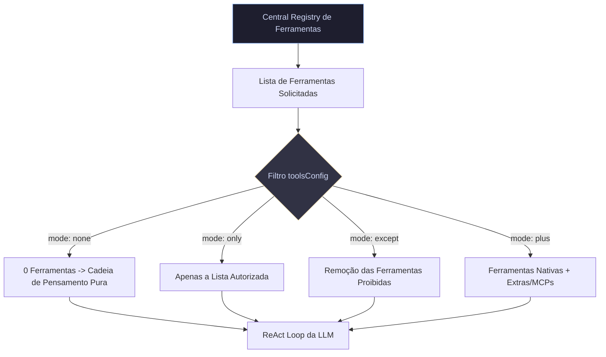

# ⚙️ 03. Controle de Ferramentas e Modo Cadeia de Pensamento

Este documento detalha o sistema de controle de ferramentas (`toolsConfig`), os 4 modos de restrição de execução (`none`, `only`, `except`, `plus`), o bloqueio de terminal e o mecanismo de segurança **Human-in-the-Loop (HITL)** do **`crom-agente`**.

---

## 📑 Sumário
1. [Arquitetura do Registro de Ferramentas](#1-arquitetura-do-registro-de-ferramentas)
2. [Os 4 Modos de Restrição (`toolsConfig`)](#2-os-4-modos-de-restrição-toolsconfig)
3. [Modo Cadeia de Pensamento Pura (`mode: "none"`)](#3-modo-cadeia-de-pensamento-pura-mode-none)
4. [Bloqueio de Comandos de Terminal (`BlockedCommands`)](#4-bloqueio-de-comandos-de-terminal-blockedcommands)
5. [Sistema de Permissões Human-in-the-Loop (HITL)](#5-sistema-de-permissões-human-in-the-loop-hitl)

---

## 1. Arquitetura do Registro de Ferramentas

O `crom-agente` possui uma central de ferramentas unificada ([registry.go](file:///home/j/Documentos/GitHub/crom-agente/internal/tools/registry/registry.go)) que gerencia mais de 50 ferramentas nativas (leitura de arquivo, edição, cliente HTTP, monitoramento de portas, análise AST, etc.).



---

## 2. Os 4 Modos de Restrição (`toolsConfig`)

Na classe `CromAgentEngine` (TypeScript SDK) e no `WorkspaceConfig` (Go Engine), você define a estratégia de ferramentas:

### 1. `mode: "none"` (Cadeia de Pensamento Pura / Toolless)
- O agente não recebe a definição de NENHUMA ferramenta.
- O payload de opções de requisição para a LLM vai com `tools: []`.
- **Uso ideal**: Classificação de textos, resumos, tradução, validação lógica e parsing de dados.

### 2. `mode: "only"` (Estritamente Autorizadas)
- O agente só pode enxergar e invocar as ferramentas explicitamente declaradas em `list`.
- **Exemplo**: `toolsConfig: { mode: "only", list: ["http_client", "mcp_postgres"] }`.

### 3. `mode: "except"` (Bloqueio Seletivo)
- O agente mantém todas as ferramentas nativas, **exceto** as que você incluir em `list`.
- **Exemplo**: `toolsConfig: { mode: "except", list: ["write_file", "delete_file", "terminal_command"] }`.

### 4. `mode: "plus"` (Ferramentas Adicionais)
- O agente mantém o conjunto básico e estende com as ferramentas ou scripts da lista fornecida.

---

## 3. Modo Cadeia de Pensamento Pura (`mode: "none"`)

No Modo Cadeia de Pensamento Pura, o ciclo cognitivo elimina os passos de execução de ferramentas no sistema operacional, operando como um pipeline direto:

```typescript
import { CromAgentEngine } from "@crom/agente-sdk";

const agentePensamento = new CromAgentEngine({
  provider: "openrouter",
  model: "google/gemini-2.5-flash",
  toolsConfig: { mode: "none" } // 0 ferramentas enviadas para o LLM
});

const resultado = await agentePensamento.run(`
Recebi o seguinte erro de log: "FATAL: Connection refused to 127.0.0.1:5432".
Analise o erro e me dê a causa provável e a solução em formato JSON.
`, { jsonResponse: true });

console.log(resultado.data);
```

---

## 4. Bloqueio de Comandos de Terminal (`BlockedCommands`)

Se o agente tiver acesso à ferramenta `terminal_command`, você pode definir em `.crom/config.json` ou via SDK comandos perigosos que devem ser **bloqueados na origem**:

```json
{
  "permission_mode": "scoped",
  "blocked_commands": [
    "rm",
    "sudo",
    "chmod",
    "dropdb",
    "curl",
    "wget"
  ]
}
```

---

## 5. Sistema de Permissões Human-in-the-Loop (HITL)

O `crom-agente` oferece três modos globais de interação e autorização ([manager.go](file:///home/j/Documentos/GitHub/crom-agente/internal/permission/manager.go)):

1. **`total_access`**: Executa qualquer ação autonomamente (uso em contêineres e testes).
2. **`ask_every_time`**: Toda ação exige confirmação manual do operador humano no terminal/GUI.
3. **`scoped`**: Pergunta a primeira vez e salva o grant aprovado em `.crom/permissions.json` para autorizar invocações futuras equivalentes.
4. **`function`**: Modo isolado sem interação que nega escritas/comandos automaticamente.
