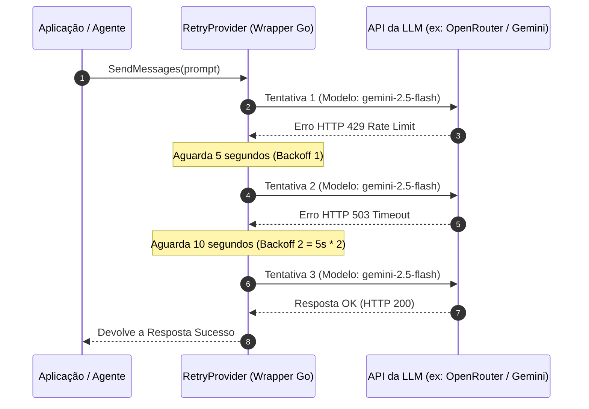

# 🛡️ 06. Resiliência e Arquitetura do RetryProvider

Este documento descreve o mecanismo de resiliência e alta disponibilidade do **`crom-agente`**, detalhando o funcionamento do wrapper **`RetryProvider`** no motor Go e a estratégia de re-tentativa com **Backoff Exponencial mantendo estritamente o mesmo modelo** escolhido pelo cliente.

---

## 📑 Sumário
1. [Visão Geral da Resiliência](#1-visão-geral-da-resiliência)
2. [A Regra de Ouro: Respeito Estrito ao Modelo Escolhido](#2-a-regra-de-ouro-respeito-estrito-ao-modelo-escolhido)
3. [Código-Fonte do `RetryProvider` em Go](#3-código-fonte-do-retryprovider-em-go)
4. [Algoritmo de Exponential Backoff](#4-algoritmo-de-exponential-backoff)
5. [Filtro Inteligente de Erros Irrecuperáveis](#5-filtro-inteligente-de-erros-irrecuperáveis)

---

## 1. Visão Geral da Resiliência

Ao operar em ambiente de produção integrando com APIs de LLM remotas (OpenAI, Anthropic, Gemini, OpenRouter), instabilidades de rede, oscilações de infraestrutura ou respostas HTTP `429 (Rate Limit)` e `503 (Service Unavailable)` podem ocorrer.

O `crom-agente` implementa uma camada de resiliência nativa chamada `RetryProvider` ([retry_provider.go](file:///home/j/Documentos/GitHub/crom-agente/internal/llm/providers/retry_provider.go)).



---

## 2. A Regra de Ouro: Respeito Estrito ao Modelo Escolhido

> [!IMPORTANT]
> O `crom-agente` **NUNCA** alterna para outro modelo de LLM ou outro provedor por conta própria.

### Por que não trocar de modelo automaticamente?
1. **Compliance e Privacidade**: Dados confidenciais do usuário autorizados para um provedor específico não devem ser direcionados para terceiros sem autorização explícita.
2. **Previsibilidade de Custos**: Modelos possuem tabelas de preço distintas (ex: trocar Gemini Flash por Claude Opus aumentaria drasticamente o custo por token).
3. **Consistência de Resposta**: Modelos diferentes possuem comportamentos de raciocínio e formatos de Tool Calling distintos.

---

## 3. Código-Fonte do `RetryProvider` em Go

Extrato do motor interno Go ([internal/llm/providers/retry_provider.go](file:///home/j/Documentos/GitHub/crom-agente/internal/llm/providers/retry_provider.go)):

```go
package providers

import (
	"context"
	"fmt"
	"log/slog"
	"strings"
	"time"

	"github.com/crom/crom-agente/internal/llm"
)

type RetryProvider struct {
	underlying llm.Provider
	maxRetries int
}

func NewRetryProvider(p llm.Provider, retries int) *RetryProvider {
	if retries <= 0 {
		retries = 3
	}
	return &RetryProvider{
		underlying: p,
		maxRetries: retries,
	}
}

func (r *RetryProvider) SendMessages(ctx context.Context, messages []llm.Message, opts llm.RequestOptions) (*llm.Response, error) {
	var lastErr error
	backoff := 5 * time.Second

	for i := 0; i < r.maxRetries; i++ {
		resp, err := r.underlying.SendMessages(ctx, messages, opts)
		if err == nil {
			return resp, nil
		}

		// Filtra erros irrecuperáveis que não devem tentar novamente
		errStr := strings.ToLower(err.Error())
		if strings.Contains(errStr, "invalid api key") ||
			strings.Contains(errStr, "unauthorized") ||
			strings.Contains(errStr, "context canceled") {
			return nil, err
		}

		lastErr = err
		slog.Warn("Falha na chamada LLM, tentando novamente...",
			"provider", r.Name(),
			"tentativa", i+1,
			"max_tentativas", r.maxRetries,
			"erro", err)

		select {
		case <-ctx.Done():
			return nil, ctx.Err()
		case <-time.After(backoff):
			backoff *= 2
			if backoff > 30*time.Second {
				backoff = 30 * time.Second
			}
		}
	}

	return nil, fmt.Errorf("todas as %d tentativas falharam: %w", r.maxRetries, lastErr)
}
```

---

## 4. Algoritmo de Exponential Backoff

1. **Tentativa 1**: Inicia imediatamente.
2. **Se falhar (Tentativa 1)**: Aguarda **5 segundos**.
3. **Se falhar (Tentativa 2)**: Dobra o tempo para **10 segundos** (`5s * 2`).
4. **Se falhar (Tentativa 3)**: Dobra para **20 segundos** (`10s * 2`), limitado ao teto máximo de **30 segundos**.

---

## 5. Filtro Inteligente de Erros Irrecuperáveis

O `RetryProvider` detecta erros nos quais tentar novamente com o mesmo modelo não trará sucesso e aborta a execução imediatamente:

- `invalid api key` (Chave de API incorreta ou revogada).
- `unauthorized` (Sem permissão de acesso ao modelo).
- `context canceled` (O cliente cancelou a requisição HTTP/gRPC).
