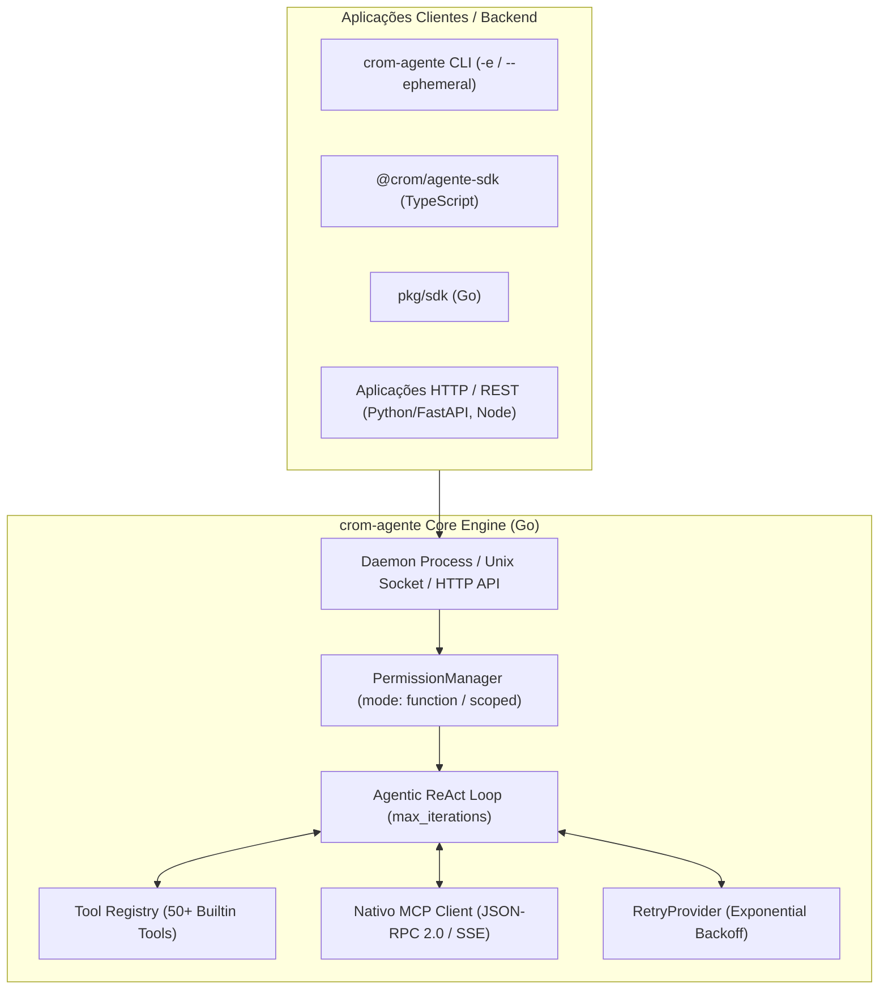

# 📚 Documentação Técnica do `crom-agente`

Bem-vindo à suíte oficial de documentação técnica do **`crom-agente`**. Esta documentação cobre a arquitetura, modos de execução isolados, integração com banco de dados, SDK em TypeScript e Go, resiliência e receitas de código para produção.

---

## 🧭 Índice de Documentos

| # | Arquivo | Descrição |
| :---: | :--- | :--- |
| **01** | 🚀 [01_MODOS_DE_EXECUCAO.md](file:///home/j/Documentos/GitHub/crom-agente/documentacao/01_MODOS_DE_EXECUCAO.md) | Flag nativa `--ephemeral` (`-e`), perfil `permission_mode: "function"` (read-only) e comparativo de modos. |
| **02** | 🗄️ [02_USO_SEM_WORKSPACE_E_BANCO_DE_DADOS.md](file:///home/j/Documentos/GitHub/crom-agente/documentacao/02_USO_SEM_WORKSPACE_E_BANCO_DE_DADOS.md) | Uso como motor de inferência puro, processamento de payloads de banco de dados sem arquivos soltos no disco. |
| **03** | ⚙️ [03_CONTROLE_DE_FERRAMENTAS_E_CADEIA_DE_PENSAMENTO.md](file:///home/j/Documentos/GitHub/crom-agente/documentacao/03_CONTROLE_DE_FERRAMENTAS_E_CADEIA_DE_PENSAMENTO.md) | Restrição de ferramentas (`toolsConfig`), os 4 modos (`none`, `only`, `except`, `plus`), bloqueios de terminal e permissões HITL. |
| **04** | 🔌 [04_SERVIDORES_MCP_E_INTEGRACAO.md](file:///home/j/Documentos/GitHub/crom-agente/documentacao/04_SERVIDORES_MCP_E_INTEGRACAO.md) | Integração com o Model Context Protocol (MCP) via Stdin/Stdout e SSE para conectores Postgres, GitHub e APIs. |
| **05** | 📦 [05_SDK_TYPESCRIPT_E_CLASSE_ENGINE.md](file:///home/j/Documentos/GitHub/crom-agente/documentacao/05_SDK_TYPESCRIPT_E_CLASSE_ENGINE.md) | Referência da classe `CromAgentEngine` no `@crom/agente-sdk`, Zod Schema validation e telemetria (`durationMs`, tokens, custo USD). |
| **06** | 🛡️ [06_RESILIENCIA_E_RETRY_PROVIDER.md](file:///home/j/Documentos/GitHub/crom-agente/documentacao/06_RESILIENCIA_E_RETRY_PROVIDER.md) | Arquitetura do `RetryProvider` nativo Go em `internal/llm/providers/retry_provider.go` e Backoff Exponencial no mesmo modelo. |
| **07** | 💡 [07_RECEITAS_E_EXEMPLOS_PRATICOS.md](file:///home/j/Documentos/GitHub/crom-agente/documentacao/07_RECEITAS_E_EXEMPLOS_PRATICOS.md) | Receitas de produção completas para Node.js (Express / Fastify), TypeScript, Python (FastAPI) e Go (Fiber). |

---

## 🛠️ Arquitetura do Sistema

